$$
\newcommand{\sp}[2]{\mathbb{S}_\text{#1}^\text{#2}}
\newcommand{\dsp}[2]{\Delta\mathbb{S}_\text{#1}^\text{#2}}
\newcommand{\spr}[2]{\mathbb{S}_\text{#1}^{\text{#2*}}}
\newcommand{\dspr}[2]{\Delta\mathbb{S}_\text{#1}^{\text{#2*}}}
\newcommand{\coo}{CO~2~}
$$

# Virtual greenhouse model

*Niels Holst, Aarhus University, Denmark, 25 May 2023.*

## R scripts

The documentation comes with R script that demonstrate the equations and logic of the model. Before you run any of the scripts, you need to change the R work folder. This is defined in the `setup.R` script, which begins like this:

```
# Prelude
setwd("~/QDev/UniSim3/input/models/vg")
library(ggplot2)
library(ggpubr)
library(plyr)
library(reshape2)
...
```

* Edit the file path in the `sewtd(...)` statement to point to the folder where you put the R scripts.
* Make sure the four libraries (loaded in lines 3 to 6) are all installed on your computer.
* Run the `setup.R` script once before running any of the other scripts.

## Model structure

The model is updated iteratively in a loop at a time step of $\Delta t$ (s), typically in a range of 2 to 5 minutes; however, the energy and water [budgets](#budgets) may be resolved at a finer time step as needed (dividing $\Delta t$ into $n$ sub-steps). The model runs from the chosen start date until the end date; however, beneath the surface it will always start 24 hours before the start date to allow model state variables to evolve from their initial values and reach realistic values.

Model components are updated in the following order:

1. **Calender** updates current date and time.
2. **Outdoors** updates climatic variables based on the weather file. Readings from the weather file are interpolated linearly to estimate values for the current date and time. If the weather file does not contain a `Tsky` column, sky temperature is estimated by a model. Soil temperature is currently roughly modelled (this needs an update).
3. **Greenhouse construction** contains the [dimensions](#greenhouse-dimensions) of the greenhouse and a description of each of the six greenhouse faces (traditionally, glass, see [cover layer](#cover-layer)). 
4. [**Setpoints**](#setpoints) are defined for the green house actuators, such as growth lights, heat pipes, ventilation, screens and CO~2~ diffusers, to keep indoors climate within the desired bounds.
5. [**Controllers**](#controllers) use the setpoints to compute the settings of actuators.
6. [**Actuators**](#actuators) represent growth lights, heat pipes, ventilation, screens, CO~2~ diffusers, *etc.*, which control the greenhouse climate. They are governed by the setpoints via the controllers.
7. **Indoors** holds the [greenhouse compartments](#greenhouse-compartments) of layers and volumes and keeps their state variables updated, reflecting the current outdoors driving variables and actuator settings.
8. **Output** writes the chosen variables to the output file.

### Boxscript example with calendar

The simulation begins 24 hours before the declared beginning of the simulation. This allows model state variables to attain sensible initial values. Here is a possible layout of a boxscript. The lonely `:` characters denote left-out lines:

```
Simulation sim {
  Box global {
    &beginDate = 2022/08/01
    :
  }
  Calendar calendar {
    .latitude  = 55.4
    .longitude = 10.4
    .begin = global[beginDate] - 1
    .end   = 2022/08/15
    .timeStep = 15
    .timeUnit = "m"
  }
  Outdoors outdoors { 
  : 
  }
  Box construction {
  :
  }
  Box setpoints {
  :
  }
  Controllers controllers {
  :
  }
  Box actuators {
  :
  }
  Box indoors {
  :
  }
  OutputR output {
  	:
    OutputSelector {
      .beginDateTime = global[beginDate]
    }
  }
}
```

A `global` box is declared to hold global settings, i.e., parameters that serve as inputs to one or more of the boxes further down in the boxscript. A `beginDate` port is created (the ampersand `&` means that a new port is created) to start the simulation on 1 August 2022. The `calendar` actually starts one day before, as set by its `begin` port (line 9); the initial period `.` denotes an existing input port. At the very end of the boxscript, an `OutputSelector` box asks for the output to be written starting on 1 August (line 35). In effect, the initial extra day's output will be discarded. The simulation will run until the final date `end` set by the `calendar` box; the time step has been set to 15 minutes (lines 10-11).

# Greenhouse virtualization

## Greenhouse compartments

### Greenhouse dimensions

The greenhouse consists of $n$ spans each of width $w$ (m), length $\ell$ (m) and wall height $h$ (m). Each span has a roof on top angled at $u$ (&deg;). 

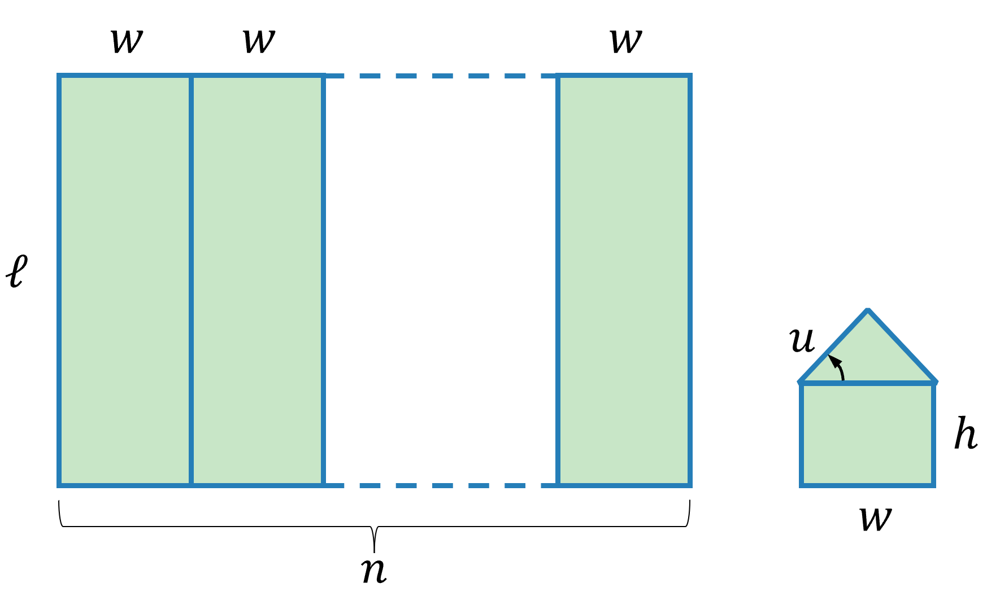

From these parameters we can derive several measures of greenhouse geometry. The area of a single face, either side, end or roof, is
$$
\begin{align}
A_{side}' &= \ell h \\[6pt]
A_{end}'  &= wh + \frac{w^2}{4}sin(u)\\[6pt]
A_{roof}' &= \frac{w\ell}{2}\,\sqrt{1+sin^2(u)}
\end{align}
$$
from which follows the total area of side, end and roof faces, and the total cover area (all in m^2^),
$$
\begin{align}
A_{side}  &= 2A_{side}' \\[6pt]
A_{end}   &= 2nA_{end}' \\[6pt]
A_{roof}  &= 2nA_{roof}' \\[6pt]
A_{cover} &= A_{side} + A_{end} + A_{roof}
\end{align}
$$
The ground area (m^2^) enclosed by the greenhouse is
$$
A_{gh}=n\ell w
$$
and the volume contained (m^3^) is
$$
\begin{equation}
V_{gh} = n\ell A_{end}'
\label{greenhouse_volume}
\end{equation}
$$
Further useful measures are the cover/area ratio $C_{ai}$ (m^2^ cover/m^2^ ground),
$$
\begin{equation}
C_{ai} = \frac{A_{cover}}{A_{gh}}
\label{eq_cai}
\end{equation}
$$
and the volumetric area index $V_{ai}$ (m) (also known as the average height),
$$
\begin{equation}
V_{ai}=\frac{V_{gh}}{A_{gh}}
\label{average_height}
\end{equation}
$$

Furthermore, the density of air $\rho_{air}=1.19$ kg/m^3^ and it heat capacity $C_{air}=1\,020$ J/kg/K leads to the heat capacity of indoors air $C_{gh}$ (J/K/m^2^ ground),
$$
\begin{equation}
C_{gh} = \rho_{air} C_{air} V_{ai}
\label{eq_c_gh}
\end{equation}
$$
The equations above have been coded in the `greenhouse-geometry.R` script::

```
n = 25
w = 4
L = 100
h = 3.5
u = 26

A_side_            350.000
A_end_              15.753
A_roof_            218.373

A_side             700.000
A_end              787.674
A_roof           10918.650
A_cover          12406.325

A_gh             10000.000
V_gh             39383.711
cover_per_ground     1.241
avg_height           3.938
C_gh              4780.395
```

#### Boxscript example

In boxscripts, greenhouse dimensions are set in the `geometry` box inside `construction`:

```
Box construction{
  vg::Geometry geometry{
    .numSpans = 25
    .spanWidth = 4
    .length = 100
    .height = 3.5
    .roofPitch = 26
  }
  :
}
```

### Volumes

The greenhouse model holds three volumes: **indoors**,  **outdoors** and **soil**. The indoors holds **state variables**, while the outdoors and soil hold **driving variables**. All three hold temperature $T$ (&deg;C), while indoors and outdoors hold relative humidity $H^\%$ (%) and CO~2~ concentration $[CO_2]^{ppm}$ as well. In some relations other units are more convenient, e.g. absolute humidity $H^{abs}$ (kg/m^3^),  water vapour pressure $H^{pres}$ (Pa), or absolute CO~2~ concentration $[CO_2]^{abs}$ (g/m^3^). The variable are subscripted to denote the volume, e.g., for temperature $T_{in}$, $T_{out}$ and $T_{soil}$.

Volumes may exchange heat and humidity with neighbouring volumes and layers.

### Layers

Besides layers the greenhouse and its environment is conceptualised as a stack of $i=1..n$ horizontal layers. This is a typical stack:

1. sky
2. cover (e.g., glass)
3. screen 
4. growth light 
5. plant canopy
6. heat pipe
7. floor

Depending on the scenario, layers can be removed or added (e.g., additional screen layers or a table layer ). All layers, whether they are horisontal or inclined, uniform or heterogeneous, thick or thin, are simplified to describe an average 1m^2^ ground area of the greenhouse. For screens this area will vary according to what degree they are drawn. Where the unit m^2^ is used, it always refers to m^2^ ground. Sometimes it is spelled out "m^2^ ground" to avoid confusion.

The radiative properties of each layer is parameterised for three intervals of the spectrum:

* **PAR**  (&#956;mol/m^2^/s) 
* **short-wave radiation** (W/m^2^) 
* **long-wave radiation** (W/m^2^)

PAR is a subset of the short-wave radiation. The PAR budget is resolved only to compute how much is absorbed by the plant canopy. Its quantum units reflect this purpose. In contrast, the short- and long-wave radiation both contribute to the radiative exchange of heat among layers. Remember that W = J/s. 


Each layer $i$ is characterised by its radiative properties: **absorptivity** $(\alpha^r_i$), **reflectivity** $(\rho^r_i)$ and **transmissivity** $(\tau^r_i)$ for radiation coming from **above** and similarly for radiation coming from **below** $(\alpha{^r_i}',\rho{^r_i}',\tau{^r_i}')$, all for each type of radiation $r$ (*PAR*, *sw*, *lw*). The radiative parameters always add up to unity,   $\alpha^r_i+\rho^r_i+\tau^r_i=1$ and  $\alpha{^r_i}'+\rho{^r_i}'+\tau{^r_i}'=1$. We apply the common engineering assumption that **emissivity** equals the absorptivity for long-wave radiation, i.e. for all layers $\epsilon_i=\alpha_i^{lw}$ and $\epsilon_i'={\alpha_i^{lw}}'$. 

The superscript $r$ was left out of the figure above for simplification but it is important, as it allows different parameter settings for different radiation intervals. This is essential, e.g. for the distinct difference in transmissivity of glass for short- *vs.* long-wave radiation. Moreover, the separate parameter sets for down- and upgoing radiation allow for asymmetry, e.g., of screens.

Layers are further described by their area-specific heat capacity ($C_i$; J/K/m^2^ ground) and temperature ($T_i$; &deg;C).

#### Boxscript example with cover and screens

The `construction` box holds two child boxes, `geometry` and `shelter`. The shelter box holds definitions of different cover and screen materials inside the `covers` and `screens` box, respectively. In the boxscript below, one kind of cover is defined (named `glass`) and four kinds of screens (named `energy`, `shade1`, `shade2` and `blackout`). You can name the materials as you want.

The `faces` box (lines 67-98) holds the named materials of cover and screens for each of the six shelter faces. There may be more than one layer of screens installed. These screen layers are written in sequence starting nearest the glass. For example, with up to three layers installed on a face, you might have faces with screens specified as `energy+shade1+blackout`, `none+shade2+blackout`, `energy+none+blackout` or `none+none+blackout`, or any other combination of screen materials defined by the names of the `shelter/screens/*` boxes. All six faces must have the same number of screens defined. If a face has no screen in a certain layer, it is written as `none`.

```
Box construction{
  vg::Geometry geometry{
    .numSpans = 25
    .spanWidth = 4
    .length = 100
    .height = 3.5
    .roofPitch = 26
  }
  Box shelter {
    UWind Utop {
    }
    Box covers {
      Cover glass {
        .swReflectivityTop      = 0.1
        .swTransmissivityTop    = 0.8
        .swReflectivityBottom   = 0.1
        .swTransmissivityBottom = 0.8
        .lwReflectivityTop      = 0.15
        .lwTransmissivityTop    = 0.20
        .lwReflectivityBottom   = 0.15
        .lwTransmissivityBottom = 0.20
        .Utop                   = ../../Utop[value]
        .Ubottom                = 1.2
        .heatCapacity           = 8400
        .swReflectivityChalk    = actuators/chalk[swReflectivity]
        .lwReflectivityChalk    = actuators/chalk[lwReflectivity]
      }
    }
    Box screens {
      Screen energy {
        .swReflectivityTop      = 0.93
        .swTransmissivityTop    = 0.0
        :
        .Utop                   = 1.2
        .Ubottom                = 1.2
        .heatCapacity           = 80
        .state = actuators/screens/energy[state]
      }
      Screen shade1 {
        .swReflectivityTop      = 0.70
        .swTransmissivityTop    = 0.20
        :
        .Utop                   = 1.2
        .Ubottom                = 1.2
        .heatCapacity           = 80.
        .state = actuators/screens/shade[state]
      }
      Screen shade2 {
        .swReflectivityTop      = 0.80
        .swTransmissivityTop    = 0.10
        :
        .Utop                   = 1.1
        .Ubottom                = 1.1
        .heatCapacity           = 120.
        .state = actuators/screens/shade[state]
      }
      Screen blackout {
        .swReflectivityTop      = 0.05
        .swTransmissivityTop    = 0.0
        :
        .Utop                   = 1.2
        .Ubottom                = 1.2
        .heatCapacity           = 200.
        .state = actuators/screens/blackout[state]
      }
    }
    Box faces {
      Box roof1 {
        &cover = "glass"
        &screens = "energy+shade1+blackout"
      	&area = ../../geometry[roofArea]/2
        &weight = 1
      }
      Box roof2 {
        &cover = "glass"
        &screens = "energy+shade1+blackout"
      	&area = ../../geometry[roofArea]/2
        &weight = 1
      }
      Box side1 {
        &cover = "glass"
        &screens = "none+shade2+blackout"
      	&area = ../../geometry[sideArea]/2
        &weight = 1
      }
      Box side2 {
        &cover = "glass"
        &screens = "none+none+blackout"
      	&area = ../../geometry[sideArea]/2
        &weight = 0.5
      }
      Box end1 {
        &cover = "glass"
        &screens = "none+none+blackout"
      	&area = ../../geometry[endArea]/2
        &weight = 0.2
      }
      Box end2 {
        &cover = "glass"
        &screens = "energy+none+blackout"
      	&area = ../../geometry[endArea]/2
        &weight = 0.2
      }
    }
  }
}
```

Any layer has 11 input ports defining its basic radiative properties (lines 14-21), $U$-values (lines 22-23) and heat capacity (line 24).  `Cover` boxes holds two additional inputs (lines 25-26) specifying the current status of whitening ('chalk'), which is provided by the `chalk` actuator. In a similar vein, `Screen` boxes hold one additional input `state`, which refers to a screen actuator. From the code above, you can infer that in this model there are three screen actuators:

* `actuators/screens/energy`which determines the position of the `energy` screen
* `actuators/screens/shade` which determines the position of the `shade1` and `shade2` screens
* `actuators/screens/blackout` which determines the position of the `blackout` screen

In addition to `cover` and `screens`, each face has a weight parameter that is used when calculating the average radiative properties of the greenhouse cover and each screen layer. The settings above suggest that `side2` is north-facing.

### Processes of heat exchange

#### Radiative exchange

Radiation might be emitted by a layer, both down- and upwards, in terms of PAR ($E_i^{par},\,{E_i^{par}}'$; &#956;mol/m^2^/s) and short- and long-wave radiation ($E_i^{sw},\,{E_i^{sw}}',\, E_i^{lw},\,{E_i^{lw}}'$; W/m^2^). For some layers (sky, cover, screen, floor) , the emission of long-wave radiation is calculated from their temperature, according to the [Stefan-Boltzmann Law](https://en.wikipedia.org/wiki/Stefan%E2%80%93Boltzmann_law),
$$
\begin{equation}
\begin{split}
E_{i}^{lw} & =\sigma\epsilon_i'(T_i+T_0)^4 \\[6pt]
{E_{i}^{lw}}' & =\sigma\epsilon_i(T_i+T_0)^4
\end{split}
\label{stefan_boltzmann}
\end{equation}
$$
where $T_0=273.15$ &deg;C converts to absolute temperature.  For other layers (growth light, plant canopy, heat pipe), the emission is calculated by specific sub-models..

The emitted radiation is intercepted by neighbouring layers, its ultimate fate determined by the characteristics (absorptivity, reflectivity, transmissivity) of the whole stack of layers, as worked out in the [energy budget](#energy-budget). The net radiative absorption of a layer (i.e. its absorption minus emission) is denoted by  ($A_i^{par},\,{A_i^{par}}'$; &#956;mol/m^2^/s) and ($A_i^{sw},\,{A_i^{sw}}',\, A_i^{lw},\,{A_i^{lw}}'$; W/m^2^).

#### Convection and conduction

The exchange of heat between layer $i$'s upper and lower surface and the confronting volume is described by $U_i$ on the upper side and $U_{i}'$ on the lower side (both in W/K/m^2^). The mechanism of heat exchange is convection for air volumes and conduction for the soil volume but despite that they are all superscripted as $A_i^{conv}$.

The convective/conductive heat absorbed by layer $i$ (W/m^2^) from the volume above and below is, respectively,
$$
\begin{equation}
\begin{split}
A_i^{conv} &= U_i(T_{Vi}-T_i) \\[6pt]
{A_i^{conv}}' &= U_i'({T_{Vi}}'-T_i)
\end{split}
\label{u_heat}
\end{equation}
$$
where the temperature of the volume above and below layer $i$ is denoted by $T_{Vi}$ and $T_{Vi}'$, respectively.

#### Advection 

##### Ventilation rate integration

Advective heat transfer occurs when outdoors air replaces indoors air. This is due to intentional ventilation as well as inadvertent leakage. We formulate the ventilation rate as, "how many times greenhouse air is replaced per hour" $v$ (h$^{-1}$).

During a time step $\Delta t$ the indoors temperature $T_{in}$ and absolute humidity $H_{in}^{abs}$ will approach the outdoors $T_{out}$ and $H_{out}^{abs}$. Considering either variable and assuming a perfect mixture of air inside the greenhouse, the rate of change in the indoors variable $y_{in}$ is
$$
\frac{dy_{in}}{dt} = v(y_{out}-y_{in})
$$
Integration gives us
$$
\begin{equation}
y_{in}(t) = y_{out} - \left[y_{out}-y_{in}(0) \right]\,exp(-vt)
\label{eq_advection}
\end{equation}
$$
The relation is illustrated by the `advection.R` script with $T_{out}$ at 20&deg;C and $T_{in}(0)$ either 15&deg;C or 25&deg;C. The ventilation rate was set at $v=3$ $\text{h}^{-1}$.

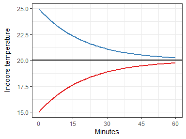

To calculate the change in indoors temperature $\Delta T_{in}$ during a time step $\Delta t$ (s) eq. $\ref{eq_advection}$ can be rewritten as
$$
\begin{equation}
\Delta T_{in} = [T_{out} - T_{in}(0)] \left[1-exp\left(-\frac{v}{3600 \text{ s/h}}\Delta t \right)\right]
\label{eq_advection_temp}
\end{equation}
$$
With a time step of, for example $\Delta t=2$ minutes, the decrease (blue curve) or increase (red curve) in indoors temperature would be $\Delta T_{in}=0.48$ K (by eq. $\ref{eq_advection_temp}$). Assuming a volumetric area index of $V_{ai}=3.94$ m^3^/m^2^ (eq. $\ref{average_height}$) and with air heat capacity $C_{air}=1\,214$ J/m^3^/K, we get the following energy flux (positive in the case of the red curve),
$$
\begin{equation}
A_{in}^{adv} = 0.48 \text{ K} \cdot 1\,214
\frac{\text{J}}{\text{m}^3\cdot\text{K}}
\cdot 
\frac{1}{120\text{ s}}\cdot 3.94\text{ m}=19.0\frac{\text{W}}{\text{m}^2}
\label{eq_advection_energy}
\end{equation}
$$
The change in indoors absolute humidity $\Delta H_{in}^{abs}$ can be arrived at in a similar fashion.

Eq. $\ref{eq_advection_temp}$ is an example of a local integral; it is solved assuming everything else remains constant. It is applied here because high values of $v$ could make a straightforward Euler integration imprecise. In this case, the difference is not so great. Euler integration would have yielded
$$
\Delta T_{in} = [T_{out} - T_{in}(0)] \frac{v}{3600 \text{ s/h}}\Delta t = 0.50 \text{ K}
$$

##### Maximum ventilation rate

The maximum ventilation rate $v_{max}$ (h$^{-1}$) is obtained when the vents are fully open. What this ventilation rate amounts to depends on the wind speed $w$ (m/s) and the difference between the indoors $T_{in}$ and outdoors $T_{out}$ temperature (&deg;C):
$$
\begin{equation}
v_{max} = \frac{A_{vent}}{A_{gh}}\sqrt{(c_w w)^2 + \left(c_T \lfloor T_{in}-T_{out}\rfloor_0 \right)^2}
\label{eq_vent_max}
\end{equation}
$$
with discharge coefficients for wind $c_w$ (s/m/h) and temperature $c_T$ (/K/h). The total discharge is found by vector addition, considering the two forces operating independently (orthogonally). It is applied to the relative vent area; $A_{vent}$ (m^2^) is the total area of vents and $A_{gh}$ (m^2^) is the greenhouse floor area. 

#### Latent heat

Latent heat is related to the phase change between water in the gas and the liquid phase. The phase change costs (by evaporation) or releases (by condensation) energy according to the latent heat of water vapourisation $\lambda=2\,454$ kJ/kg.  

In the model, transpiration cools the canopy and condensation heats the cover. The transpired water adds to air humidity, which is then considered to have increased its content of latent heat. Water vapour bears latent heat in the sense that if it condenses, the heat used for the initial phase change from liquid to gas, will be used in the phase change back from gas to liquid.

The model does not include the cooling effect of water evaporating from wet surfaces, nor the wetting and drying of screens.

# Layer characterization

## Sky layer

The radiation emitted downwards from the sky includes $E_{sky}^{par}$, $E_{sky}^{sw}$ and $E_{sky}^{lw}$. PAR and short wave radiation originates from the sun, while long wave radiation is emitted from the sky as such.

While $E_{sky}^{sw}$ is measured routinely, this is not the case for $E_{sky}^{par}$. It can be approximated by  $E_{sky}^{par}=0.5E_{sky}^{sw}$. 

Sky emissivity $\epsilon_{sky}$ (and thereby sky absorptivity $\alpha_{sky}$) is estimated from the dew point temperature $T_{dew}$ (&deg;C) by the empirical relation (ref.)
$$
\epsilon_{sky} = \left\lceil 0.732 + 0.00635T_{dew}\right\rceil^1
$$
Sky temperature $T_{sky}$ (&deg;C) is then derived from outdoors temperature $T_{out}$ (&deg;C) according to [Karn et al. 2019](https://onlinelibrary.wiley.com/doi/full/10.1002/htj.21459) 
$$
T_{sky} = \sqrt[4]{\epsilon_{sky}}(T_{out} + T_0) - T_0
$$
where $T_0=273.15$ &deg;C.

Sky reflectivity $\rho_{sky}$ is zero and consequently transmissivity is $\tau_{sky}=1-\epsilon_{sky}$.

## Cover layer

The cover layer is commonly made out of glass with the following typical characteristics:

| Glass properties                       | PAR  | Short-wave | Long-wave |
| -------------------------------------- | ---- | ---------- | --------- |
| $\alpha, \alpha', \epsilon, \epsilon'$ | 0.1  | 0.1        | 0.9       |
| $\rho, \rho'$                          | 0.1  | 0.1        | 0.1       |
| $\tau, \tau'$                          | 0.8  | 0.8        | 0.0       |


In general, the six faces of the greenhouse may carry different covers with different radiative properties. For the cover layer as a whole, each radiative parameter is summarised as the average over all faces, weighed by face area.

The density of window glass is typically $2.5$ kg/m^2^/mm, which with a thickness of $4$ mm gives a density of $10$ kg/m^2^ cover. The heat capacity of glass is $840$ J/kg/K ([Engineering Toolbox, 2023](https://www.engineeringtoolbox.com/specific-heat-capacity-d_391.html)). If we furthermore assume a cover/ground ratio of $1.24$ m^2^ cover/m^2^ ground (eq. $\ref{eq_cai}$), we get a heat capacity of the cover of
$$
\begin{equation}
C_{cover}= 10 \text{ kg/m}^2\text{ cover} \cdot
1.241\text{ m}^2\text{ cover/m}^2\text{ ground} \cdot
840 \text{ J/kg/K}=
10\,421 \text{ J/K/m}^2\text{ ground}
\label{eq_c_glass}
\end{equation}
$$
The cover emits long-wave radiation symmetrically down and up according to the Stefan-Boltzmann Law (eq. $\ref{stefan_boltzmann}$).

The $U$-values over both the inner and outer surface can be expected to increase with the wind; immobile air is a very good insulator. For the outer surface of the cover, we use the empirical relation,
$$
\begin{equation}
U_{wind} = 2.8+1.2\cdot w^{0.8}
\label{eq_u_wind}
\end{equation}
$$
where $w$ is the outdoors wind speed (m/s). The $U$-value of the inner surface is set to $1.2$ W/K/m^2^.

### Cover averaging

Since the six cover faces may differ in their characteristics, we may need to average their parameter values. Some examples applying the equations below of are shown in the `cover-averaging.R` script.

#### Cover averaging of radiative parameters

Let's assume that the two end faces differ from the other four faces; we set $\alpha=0.15$, $\rho=0.35$ and $\tau=0.60$ at the ends walls, while elsewhere, $\alpha=0.10$, $\rho=0.10$ and $\tau=0.80$. In the full model, these values have been corrected for the effects of [chalking](#chalk-actuator) before the averaging. Furthermore, let's weigh the end walls by $w_{end}=0.25$ and one side by $w_{side1}=0.20$ while the rest have full weight $w_{other}=1.0$. 

For the radiative parameters ($\alpha$, $\rho$ and $\tau$), we get their weighted averages ($\alpha_{cover}$, $\rho_{cover}$ and $\tau_{cover}$) for the cover as whole by 
$$
\begin{equation}
\begin{split}
\alpha^0=\frac{\sum_{i=1}^6w_iA_i\alpha_i}{\sum_{i=1}^6w_iA_i},\quad
\rho^0&=\frac{\sum_{i=1}^6w_iA_i\rho_i}{\sum_{i=1}^6w_iA_i},\quad
\tau^0=\frac{\sum_{i=1}^6w_iA_i\tau_i}{\sum_{i=1}^6w_iA_i} \\[6pt]
\alpha_{cover}=\frac{\alpha^0}{\alpha^0+\rho^0+\tau^0},\quad
\rho_{cover}&=\frac{\rho^0}{\alpha^0+\rho^0+\tau^0},\quad
\tau_{cover}=\frac{\tau^0}{\alpha^0+\rho^0+\tau^0}
\end{split}
\label{eq_q_cover}
\end{equation}
$$
where subscript $i$ stands for the six cover faces, and $A_i$ (m^2^) is the area of each face. Since $\alpha^0+\rho^0+\tau^0=1$ is not guaranteed, these values are subsequently rescaled to a sum of $1$.

With the numbers above and the illustrative [greenhouse dimensions](#greenhouse-dimensions) we have (with parameters pair-wise in the order: roofs, sides, ends)
$$
\begin{split}
\bar{w} &= (1,1,1,0.20,0.10,0.10) \\[6pt]
\bar{A} &= (5\,459,5\,459,350,350,394,394) \text{ m}^2\text{ cover} \\[6pt]
\bar{\alpha} &= ( 0.10,  0.10,  0.10,  0.10,  0.15,  0.15) \\[6pt]
\bar{\rho} &= ( 0.10,  0.10,  0.10,  0.10,  0.35,  0.35) \\[6pt]
\bar{\tau} &= ( 0.80,  0.80,  0.80,  0.80,  0.60,  0.60 ) 
\end{split}
$$
which gives us the averaged values,
$$
\begin{split}
\alpha_{cover} &= 0.101 \\[6pt]
\rho_{cover} &= 0.104 \\[6pt]
\tau_{cover} &= 0.795 
\end{split}
$$
The roof faces are dominating by their size; hence the average parameter values are close to the roof values. If we change all weights to one $w_i=1$, we get a larger impact of the ends: $\alpha_{cover}=0.102$, $\rho_{cover}=0.115$ and $\alpha_{cover}=0.783$.

#### Cover averaging of heat capacity

Heat capacity is averaged to apply to the greenhouse ground area (eq. $\ref{eq_c_glass}$). If, for example, the largest area is covered by glass with a heat capacity of $C_{glass}=8\,400$ J/K/m^2^ cover, while the ends have a more sturdy material with  $C_{sturdy}=18\,000$ J/K/m^2^ cover, we can calculate the total heat capacity of the cover per greenhouse area $C_{cover}$ (J/K/m^2^ ground) as
$$
\begin{equation}
C_{cover} = \frac{\sum_{i=1}^6 A_iC_i}{A_{gh}}
\label{eq_c_cover}
\end{equation}
$$
where $A_{gh}$ (m^2^) is the ground area of the greenhouse. We apply no weights to the different greenhouse faces, other than their areas, when averaging the heat capacity.

Using the the illustrative [greenhouse dimensions](#greenhouse-dimensions) we have
$$
\begin{split}
\bar{A} &= (5\,459,5\,459,350,350,394,394) \text{ m}^2\text{ cover} \\[6pt]
\bar{C} &= (8\,400,8\,400,8\,400,8\,400,18\,000,18\,000) \text{ J/K/m}^2\text{ cover}\\[6pt]
A_{gh} &= 10\,000 \text{ m}^2\text{ ground}
\end{split}
$$
which gives us
$$
C_{cover} = 11\,177\text{ J/K/m}^2\text{ ground}
$$
As expected, this heat capacity is larger than the one calculated for and all-glass greenhouse $C_{cover}=10\,421$ J/K/m^2^ ground in eq. $\ref{eq_c_glass}$.

#### Cover averaging of U-values

The $U_i$ values (W/K/m^2^ cover) are conductances (one for each face, $i=1..6$). They can also be looked upon as resistances by taking their inverse, $R_i=1/U_i$. If we assume that the six resistances work like electrical resistors in parallel, we get the total resistance of the greenhouse cover $R_{cover}$ as
$$
\frac{1}{R_{cover}} = \sum_{i=1}^6\frac{1}{R_i}
$$
It follows that conductances are simply additive. Thus the conductance of the greenhouse cover as a whole is arrived at by the sum of the faces. Relating this to the ground area of the greenhouse $A_{gh}$ (m^2^ ground), we get
$$
\begin{equation}
U_{cover} = \frac{1}{A_{gh}}\sum_{i=1}^6A_iU_i
\label{eq_u_cover}
\end{equation}
$$
As for heat capacity (eq. $\ref{eq_c_cover}$), we apply no weights to the different greenhouse faces, other than their areas.

For example, If the cover material has $U_{glass}=1.2$ W/K/m^2^, except for the end walls which have $U_{poly}=0.3$ W/K/m^2^, we get with the illustrative [greenhouse dimensions](#greenhouse-dimensions), 
$$
\begin{split}
\bar{A} &= (5\,459,5\,459,350,350,394,394) \text{ m}^2\text{ cover} \\[6pt]
\bar{U} &= (1.2,1.2,1.2,1.2, 0.3, 0.3) \text{ W/K/m}^2\text{ cover}\\[6pt]
A_{gh} &= 10\,000 \text{ m}^2\text{ ground}
\end{split}
$$
from which follows
$$
U_{cover} = 1.42 \text{ W/K/m}^2\text{ ground}
$$

The reason why the average $U_{cover}$ is larger than any $U_i$ is that the ground area is smaller than the cover area. 

## Screen layer

Screens are often constructed with asymmetric radiative properties. Here, for example, are the radiative parameters of a polyester screen with an aluminium surface on the upper side (from [Bailey 1981](https://www.sciencedirect.com/science/article/pii/0021863481901062)): 

| Screen properties                | Long-wave radiation |
| -------------------------------- | ------------------- |
| $\alpha', \epsilon'$ (polyester) | 0.57                |
| $\rho'$ (polyester)              | 0.43                |
| $\alpha, \epsilon$ (aluminium)   | 0.07                |
| $\rho$ (aluminium)               | 0.93                |
| $\tau', \tau$                    | 0.0                 |

The values in the table are for long-wave radiation only. They are most likely different for short-wave radiation but documentation for the physical characteristics of screens are hard to come by; manufacturers seem reluctant to provide the information.

Screens may be more or less drawn . If we denote how much a curtain is drawn by its position $p\in[0;1]$ then the effective radiation parameters are calculates as $p\alpha$,  $p\rho$ and $1-p\alpha-p\rho$, and likewise for $\alpha'$, $\rho'$ and $\tau'$. For the screen layer of the greenhouse as a whole, each radiative parameter is summarised as the average over all the six faces, weighed by face area, as for the cover layer. If screens are kept half-drawn for extended periods, or if faces differ much in screen material, this averaging could turn out highly unrealistic. If the greenhouse is equipped with more than one layer of screens, the screens are stacked as separate, independent layers.

Screens may be constructed of composite materials which complicates the calculation of their heat capacity. For the screen exemplified here, we found quite close values of $C_{polyester}=1.1$ J/K/g and $C_{Al}=0.89$ J/K/g. Assuming that polyester is the dominant material and a screen density of $80$ g/m^2^ screen, we get a heat capacity of the screen of
$$
\begin{equation}
C_{screen}= 80 \text{ g/m}^2\text{ screen} \cdot
1.24\text{ m}^2\text{ screen/m}^2\text{ ground} \cdot
1.1 \text{ J/K/g}=
109 \text{ J/m}^2\text{ ground}
\label{eq_c_screen}
\end{equation}
$$
This calculation implies that all six greenhouses faces are equally covered  with the same screen. If that is not the case then $S_{screen}$ must be found by calculating the heat capacity of each face separately and adding them up to give $S_{screen}$. Note that the calculated heat capacity of the screen is ~100 times less that of a glass cover (eq. $\ref{eq_c_glass}$).

The screen emits long-wave radiation according to the Stefan-Boltzmann Law (eq. $\ref{stefan_boltzmann}$). With the example above, the radiation would be asymmetric because downwards and upwards emissivity differ; this screen was designed to keep the heat indoors.

### Screen averaging

The averaging of screens in a layer follows the same principles as [cover averaging](#cover-averaging), except that screens also have a position $p\in[0;1]$. In a given layer, there may be screens on some layers but not on others; these are given full transparency, $\tau=\tau'=1$.

Thus for the radiative parameter $q$ (i.e. $\alpha$, $\rho$,  $\alpha'$ or $\rho'$), we get the weighted average $q_{screen}$ for the screen layer as a whole (cf. eq. $\ref{eq_q_cover}$),
$$
q_{screen}=\frac{\sum_{i=1}^6p_iw_iA_iq_i}{\sum_{i=1}^6p_iw_iA_i}
$$
with transmissivity as in eq. $\ref{eq_tau_cover}$,
$$
\begin{split}
\tau_{screen} &= 1 - \alpha_{screen} - \rho_{screen} \\[6pt]
\tau_{screen}' &= 1 - \alpha_{screen}' - \rho_{screen}'
\end{split}
$$
The heat capacity and U-value of screens is assumed to be in effect only when they are drawn. Hence we get (cf. eqs. $\ref{eq_c_cover}$ and $\ref{eq_u_cover}$) the total heat capacity of the screen layer $C_{screen}$ (J/K/m^2^ ground),
$$
C_{screen} = \frac{\sum_{i=1}^6 p_iA_iC_i}{A_{gh}}
$$
and  the total U-value of the screen layer $U_{screen}$ (W/K/m^2^ ground),
$$
U_{screen} = \frac{1}{A_{gh}}\sum_{i=1}^6p_iA_iU_i
$$
Some examples are shown in the `screen-averaging.R` script.

### Screen layering

Screen layers function just like any other layer (see [Layers](#layers)).  Thus there is need for special mechanisms to account for screen layering.

## Growth light layer 

Lamps are installed to provide growth light. Even so, their production of heat is a significant side effect. Light is traditionally emitted downwards from a position above the canopy. If the installed lamp power (including any ballast or driver needed by the lamps) is $P_{lamp}$ (W/m^2^) and the PAR efficiency is $e_{lamp}$ (&mu;mol PAR/J) then the emission of PAR downwards $E_{lamp}^{par}$  and upwards ${E_{lamp}^{par}}'$ (&mu;mol PAR/m^2^) is
$$
\begin{split}
E_{lamp}^{par} &= e_{lamp}P_{lamp} \\
{E_{lamp}^{par}}' &= 0
\end{split}
$$
Lamps may loose efficiency with age, which is reflected in a reduced $e_{lamp}$.

Energy is dissipated from the lamps  by three routes: short-waved and long-waved radiation and convection. The proportions are denoted $p_{lamp}^{sw}$, $p_{lamp}^{lw}$ and $p_{lamp}^{conv}$, where $p_{lamp}^{sw}+p_{lamp}^{lw}+p_{lamp}^{conv}=1$. While the short-wave radiation is assumed to be heading only downwards, the long-wave radiation and convective heat are both assumed to be emitted equally downward and upwards. Thus we have
$$
\begin{split}
E_{lamp}^{sw} &= p_{lamp}^{sw}P_{lamp} \\
{E_{lamp}^{sw}}' &= 0\\[6pt]
E_{lamp}^{lw} &= \\
{E_{lamp}^{lw}}' &= p_{lamp}^{lw}P_{lamp}/2 \\[6pt]
E_{lamp}^{conv} &= \\
{E_{lamp}^{conv}}' &= p_{lamp}^{conv}P_{lamp}/2 \\[6pt]
\end{split}
$$
The growth light layer has a 100% transmissivity ($\tau=\tau'=1$) and is attributed neither a temperature nor a heat capacity.

## Plant canopy layer

[Stanghellini (1987 ,eq. 2.1)](https://research.wur.nl/en/publications/transpiration-of-greenhouse-crops-an-aid-to-climate-management) sets up the following energy balance for the plant canopy
$$
R_n=H+LE+M+J\quad\left[\text{W/m}^2\right]
$$
The equation states (in her notation) that the energy of net radiation absorbed by the canopy $R_n$ is spent on 

* convective heat loss to the greenhouse air $H$ 
* heat for the evaporation of water needed for transpiration $LE$
* photosynthate production $M$
* heat storage in the canopy $J$

Like Stanghellini we will ignore $M$ and $J$ in the energy budget (they both make quite small contributions to the total budget) and follow her logic which leads to, surprisingly, that $H$ does not need to be taken explicitly into account either.
### Radiative properties

[Goudriaan (1977)](https://library.wur.nl/WebQuery/wurpubs/70980) provides equations (his eqs. 2.21 and 2.26) to calculate the reflectivity of a plant canopy with leaf area index $L_{ai}$ and extinction coefficient $k$. The reflection coefficient $\rho_h$ depends on the scattering coefficient $\sigma$,
$$
\rho_h=\frac{1-\sqrt{1-\sigma}}{1+\sqrt{1-\sigma}}
$$
$\sigma$ is a species-dependent parameter commonly set to $\sigma=0.2$ ([Kropff and Laar 1993, p.38](https://research.wur.nl/en/publications/modelling-crop-weed-interactions)), which gives $\rho_h=0.0557$.

The original eq. 2.26 includes the reflectivity of the surface underneath the canopy (the floor in our case). However, we will resolve the distribution of radiation among the greenhouse layers otherwise. Consequently, we can set the reflectivity of the underlying surface in the original equation to zero. Thus we get the reflectivity of the canopy, which is symmetric for up- and down-going radiation, based on his eq.2.26,
$$
\begin{equation}
\rho_{plant}^{r} = {\rho_{plant}^{r}}' =
\frac{exp(-k^{r}L_{ai})-exp(k^{r}L_{ai})}{\rho_h exp(-k^{r}L_{ai})-exp(k^{r}L_{ai})/\rho_h} \\[6pt]
\label{eq_rho}
\end{equation}
$$
where superscript $r$ denotes $par$, $sw$ or $lw$ radiation. Commonly found values for $k^{par}$ and $k^{sw}$ are in the range $0.7$ to $0.8$, while leaves are impenetrable to long-wave radiation resulting in $k^{lw}=1$.

The absorptivity of the canopy is simply
$$
\begin{equation}
\alpha_{plant}^r = {\alpha_{plant}^r}' = 1-exp(-k^rL_{ai})
\label{eq_alpha}
\end{equation}
$$
and the transmissivity
$$
\begin{equation}
\tau_{plant}^r = {\tau_{plant}^r}' = 1- \rho_{plant}^r - \alpha_{plant}^r
= 1- {\rho_{plant}^r}'- {\alpha_{plant}^r}'
\label{eq_tau}
\end{equation}
$$
The `plant-canopy-layer.R` script shows how the parameters change with increasing leaf area index for short-wave ($k=0.7$) and long-wave radiation ($k=1$):


### Canopy temperature

Note:  The figures in this sub-section were generated by the `5-energy-budget-plant.R` script.

The model of canopy temperature is taken from [Stanghellini (1987 ,eq. 3.5)](https://research.wur.nl/en/publications/transpiration-of-greenhouse-crops-an-aid-to-climate-management):
$$
\begin{equation}
T_{plant} = T_{in} +
\frac
{\frac{r_i+r_e}{2L_{ai}\rho_a C_a}A_{plant}^{rad} - 
\frac{1}{\gamma}(H_{sat}^{pres} - H_{in}^{pres})}
{1+\frac{\delta}{\gamma} + \frac{r_i}{r_e}}
\label{eq_t_plant}
\end{equation}
$$
with 

* plant and indoors climate variables

  * $T_{plant}$ : Canopy temperature (&deg;C) 

  * $T_{in}$ : Indoors air temperature (&deg;C)

  * $L_{ai}$ : Leaf area index (m^2^ leaf/m^2^ ground)

  * $r_i=r_i^{H_2O}$ : Internal (stomatal) leaf resistance against water vapour (s/m)

  * $r_e=r_e^{H_2O}$ : External (boundary layer) leaf resistance against water vapour (s/m)

  *  $A_{plant}^{rad}$: Net radiation absorbed by the canopy (W/m^2^)

  * $H_{in}^{pres}$ : Indoors air vapour pressure (Pa)

  * $H_{sat}^{pres}$ : Saturated air vapour pressure (Pa), a function of $T_{in}$

* physical variables
  * $\delta$ : Slope of saturated vapour pressure curve (Pa/K)

* physical constants and approximations
  * $\lambda$: Latent heat of vapourisation of water ($2\,454$ kJ/kg )
  * $\gamma$: The psychrometric constant, which tells how the partial pressure of water vapour changes with changes in air temperature ($67.71$ Pa/K at standard air pressure)
  * $\rho_a$: Air density, which depends on air pressure, air humidity and temperature [(Shelquist, 2023)](https://wahiduddin.net/calc/density_altitude.htm); here assumed constant ($1.19$ kg/m^3^) 
  * $C_a$: Air heat capacity, which depends on air humidity and temperature [(Powder Process, 2023)](https://powderprocess.net/Tools_html/Air/Air_Humid_Specific_Heat.html); here assumed constant ($1\,020$ J/kg/K)

The saturated vapour pressure $H_{sat}(T)$ as a function of temperature is described by the empirical equation [(FAO, 2023, eq. 11)](https://www.fao.org/3/x0490e/x0490e07.htm),
$$
\begin{equation}
H_{sat}(T) = 610.8\cdot\exp\left(\frac{17.27\cdot T}{T+237.3}\right)
\label{eq_svp}
\end{equation}
$$
It increases with temperature, as seen in the figure:


The slope $\delta(T)$ as a function of temperature is described by the empirical equation [(FAO, 2023, eq. 13)](https://www.fao.org/3/x0490e/x0490e07.htm),
$$
\begin{equation}
\delta(T) = \frac{4098}{(T+237.3)^2}\cdot H_{sat}(T)
\label{eq_svp_slope}
\end{equation}
$$
The slope is increasing with temperature too, as seen in the figure:


The internal leaf (stomatal) resistance against water vapour $r_i^{H_2O}$ is computed by the Ball-Barry (ref.) function,
$$
\begin{equation}
r_i^{H_2O} = \left[ g_0 + g_1\frac{H_{in}^{rel}}{100\%}\frac{P_n}{c_{in}^{CO_2}} \right]^{-1}
\label{eq_ri}
\end{equation}
$$
with species-specific coefficients that we here set to $g_0=0.1$ m/s and $g_1=1.64$ m^3^/mol. Other variables are

* $H_{in}^{rel}$: Relative humidity of the indoors air (%)
* $c_{in}^{CO_2}$: Indoors CO~2~ concentration (ppm)
*  $P_n:$ Net photosynthetic rate (μmol CO~2~ / leaf m^2^ / s)

Here is an example, how $r_i^{H_2O}$ behaves with increasing humidity at various CO~2~ levels and with $P_n=2.0$ μmol CO~2~ / m^2^ leaf / s. There is not much variation from the maximum set by $g_0^{-1}$:

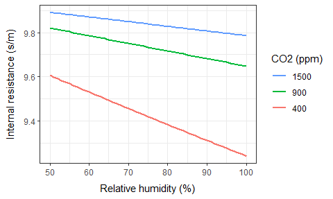

The external leaf (boundary layer) resistance to water vapour $r_e^{H_2O}$ can be computed according to  [Stanghellini (1987, eq. 2.53)](https://research.wur.nl/en/publications/transpiration-of-greenhouse-crops-an-aid-to-climate-management):
$$
\begin{equation}
r_e^{H_2O} = \frac{1\,174\sqrt{\ell}}{\sqrt[4]{\ell |T_{plant}-T_{in}| + 207u^2 }}
\label{eq_re_stangh}
\end{equation}
$$
where $\ell$ characterizes leaf dimensions and $u$ (m/s) is air velocity at the leaf surface. The constants $1\,174$ and $207$ were estimated empirically in a tomato crop by Stanghellini.

This figure shows the behaviour of $r_e^{H_2O}$ with increasing wind speed, at different leaf temperatures and leaf dimensions with $T_{in}=24$&deg;C:

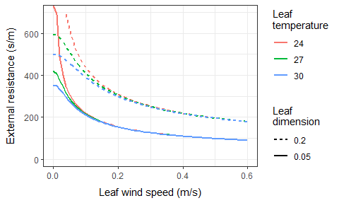

Both $\ell$ and $u$ are difficult to estimate. $\ell$ should be smaller for smaller leaves. $u$ should increase with the greenhouse ventilation rate (or if rotors are running) and decrease with $L_{ai}$, as a denser canopy will reduce the average wind speed at leaf surfaces. 

**Note:** Due to all the uncertainties, we use a fixed value in the model defaulting to 
$$
\begin{equation}
r_e^{H_2O}=200 \text{ s/m}
\label{eq_re}
\end{equation}
$$
Everything above taken together, we get the following linear response of plant temperature $T_{plant}$ (eq. $\ref{eq_t_plant}$) to the radiation absorbed by canopy $A_{plant}^{rad}$ with $L_{ai}=1.9$. The indoors temperature was set at $T_{in}=25$&deg;C and is shown as a black line in the figure: 


Clearly, a high air humidity works against  plant transpiration and leads to a higher leaf temperature, even above the ambient temperature of the greenhouse: Relatively cool leaves are a sign of a sound microclimate.

### Transpiration

Note:  The figures in this sub-section were generated by the `5-energy-budget-plant.R` script.

The model of canopy transpiration rate $H_{plant}^{trans}$ (kg/m^2^ ground/s) is taken from [Stanghellini (1987 ,eq. 3.4)](https://research.wur.nl/en/publications/transpiration-of-greenhouse-crops-an-aid-to-climate-management):
$$
\begin{equation}
H_{plant}^{trans} = 
\frac
{\frac{\delta}{\gamma}A_{plant}^{rad} + 
\frac{2L_{ai}\rho_a C_a}{\gamma\,r_e}(H_{sat}^{pres} - H_{in}^{pres})}
{\lambda\left(1+\frac{\delta}{\gamma} + \frac{r_i}{r_e}\right)}
\label{eq_transpiration}
\end{equation}
$$
with symbols defined as for eq. $\ref{eq_t_plant}$. With the same parameter settings as for the previous figure, we get this transpiration rate of the canopy (shown in units of g/m^2^ ground/min):

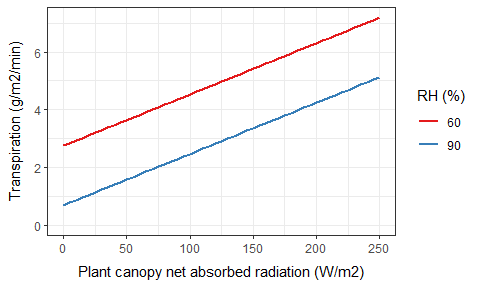

Obviously, transpiration is larger in a drier climate and it increases with the absorbed radiation. Note that leaf temperature (previous figure) too increased with absorbed radiation. This means that the increase in transpiration with increased absorbed radiation was not sufficient to keep leaf temperature constant; that would have acquired an even higher transpiration.

The phase change from water (in the plant) to water vapour (in the greenhouse air) causes an increase in the latent heat carried by the air. This heat, which is equal to $\lambda H_{plant}^{trans}$, is shown in the figure below,

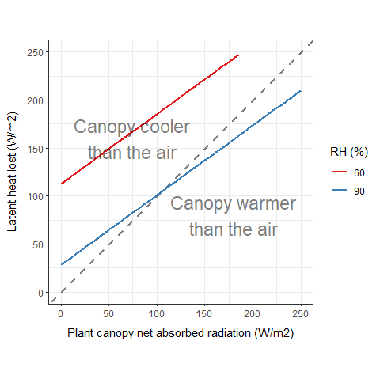

The 1:1 dashed line has been added to highlight the balance between the radiation absorbed by the canopy and the latent heat lost from the canopy. Below the line the canopy is warmer than the air, above the line the canopy is cooler than the air. Compare this with the figure of canopy temperature above. At a relative humidity of 90%, both the blue lines cross the respective reference lines at *ca.* $110$ W/m^2^. This verifies the consistency of eqs. $\ref{eq_t_plant}$ and $\ref{eq_transpiration}$. The radiative energy absorbed by the canopy ends up in latent heat bound in the air and in the heating of the canopy itself. 

The convective model of heat transfer does not match the complex physiology and physics of the canopy layer; all heat fluxes are taken care of by eqs. $\ref{eq_t_plant}$ and $\ref{eq_transpiration}$. Therefore the canopy layer is given a $U$-value of zero to make it fit into the stack of generic layers.

## Heat pipe layer

Heat pipes are installed to heat the greenhouse by convection and long-wave radiation. The transmissivity of the heat pipe layer is $\tau_{pipe}=\tau_{pipe}'=1$ for all wave lengths.

The drop in temperature ($\Delta T_{pipe}$; K) from the inlet to the outlet is modelled by the empirical equation
$$
\begin{equation}
\Delta T_{pipe} = \left( T_{pipe}^{inlet} - T_{in}\right) -
\left[k(b-1)\Delta t_{pipe} + \left(T_{pipe}^{inlet} - T_{in} \right)^{1-b}\right]^\frac{1}{1-b}
\quad\text{when}\quad T_{pipe}^{inlet} > T_{in}
\label{eq_t_pipe}
\end{equation}
$$
where $k$ and $b$ are parameters calibrated to the greenhouse, $\Delta t_{pipe}$ (s) is the transit time of pipe water, $T_{pipe}^{inlet}$ (&deg;C) is the water temperature at the pipe inlet, and $T_{in}$ (&deg;C) is the greenhouse air temperature. If the inlet temperature is not above the greenhouse temperature then $\Delta T_{pipe}=0$.

The transit time $\Delta t_{pipe}$ (min) is related to the flow rate $\dot{v}_{pipe}$ (m^3^/h) and pipe volume $V_{pipe}$ (m^3^) as
$$
\Delta t_{pipe} = \frac{V_{pipe}}{\dot{v}_{pipe}}
$$
As an example, a pipe with an inner diameter of 30 mm installed at a density of 2 m/m^2^ in a greenhouse area of 10 000 m^2^ holds the volume,
$$
\begin{equation}
V_{pipe} = \frac{\pi}{4}\cdot\left(30\text{ mm}\cdot\frac{1\text{ m}}{1\,000\text{ mm}} \right)^2 \cdot 
2 \frac{\text{m}}{\text{m}^2}\cdot10\,000\text{ m}^2 = 14.14\text{ m}^3
\label{eq_Vpipe}
\end{equation}
$$
which at a flow rate of $\dot{v}_{pipe}=20$ m^3^/h gives a transit time of
$$
\Delta t_{pipe} = \frac{14.14\text{ m}^3}{20\text{ m}^3\text{/h}} \cdot
\frac{60\text{ min}}{\text{h}} = 42.4\text{ min}
$$
The energy lost from the heat pipe $E_{pipe}^{tot}$ (W/m^2^ ground) is related to the temperature drop through the pipe $\Delta T_{pipe}$ and the flow rate $\dot{v}_{pipe}$, 
$$
\begin{equation}
E_{pipe}^{tot}  =
\frac{C_{water}\Delta T_{pipe}\dot{v}_{pipe}}{A_{gh}} \cdot
\frac{1000\text{ kg}}{\text{m}^3} \cdot
\frac{1\text{ h}}{3\,600\text{ s}}
\label{eq_e_pipe}
\end{equation}
$$
where $C_{water}=4\,184$ J/K/kg is the heat capacity of water and $A_{gh}$ (m^2^ ground) is the ground area of the greenhouse. Proper conversion of units must be observed.  With $\Delta T_{pipe}=30$ K, for example, we get
$$
E_{pipe}^{tot} = \frac{4\,184\text{ J/K/kg} \cdot 30\text{ K} \cdot 20\text{ m}^3\text{/h}}
{10\,000\text{ m}^2 } \cdot
\frac{1000\text{ kg}}{\text{m}^3} \cdot
\frac{1\text{ h}}{3\,600\text{ s}} = 69.7\text{ W/m}^2
$$
As an example, we set $k=0.0063$ and $b=1.25$ with an indoors temperature $T_{in}=20$&deg;C. We choose a range of inlet temperatures $T^{inlet}_{pipe}=20..80$&deg;C and two different flow rates $\dot{v} = (10,20)$ m^3^/h. Other parameters keep the values used in the examples above. We then get the following drop in water temperature $\Delta T_{pipe}$ (eq. $\ref{eq_t_pipe}$) reached at the pipe outlet and the associated energy $E_{pipe}^{tot}$ (eq. $\ref{eq_e_pipe}$) lost to the greenhouse (plots generated by the `heat-pipes.R` script):


Heat pipe energy is emitted as a combination of radiant and convective heat.  We denote the proportion of long-wave radiation $p_{pipe}^{lw}\in[0;1]$ and, assuming that it is radiated equally down- and upwards, we get
$$
E^{lw}_{pipe} = {E^{lw}_{pipe}}' = p^{lw}_{pipe}E^{tot}_{pipe}/2
$$
The other part is conveyed to the greenhouse air. Since convective heat is defined relative to the layers (eq. $\ref{u_heat}$), the convective heat flow from the heat pipes is negative,
$$
A^{heat}_{pipe} = -\left(1-p^{lw}_{pipe} \right)E^{tot}_{pipe}
$$
Since the volume above and below the heat pipes is the same, i.e. the greenhouse air, we let $A^{heat}_{pipe}$ account for the whole heat exchange and set ${A^{heat}_{pipe}}'=0$ (see eq. $\ref{u_heat}$).

## Floor layer

A floor made of concrete has typical values $\alpha_{floor}=0.6$ and $\rho_{floor}=0.4$. It emits long-wave radiation upwards according to the Stefan-Boltzmann Law (eq. $\ref{stefan_boltzmann}$) and exchanges heat with the soil by conduction (eq. $\ref{u_heat}$). We assume a good insulation of the floor against the soil setting  $U_{floor}'=0.1$ W/K/m^2^.

## Soil temperature

Soil is not treated as a layer in the model but as a volume below the floor layer (see [Volumes](#volumes) and [Layers](#layers)). Anyway, the model of soil temperature is naturally presented here.

Soil is defined only vaguely by the model. As a volume it is endless in reality, and it has got not a single temperature but a gradient of temperatures stretching downwards under the greenhouse and inwards from the base of the walls. Considering the complexity of vertical and horizontal gradients of soil temperature, a simple, generic model is called for. Consequently, we set soil temperature at time $t$ equal to the average outdoors temperature over the last 7 days.
# Setpoints

All setpoints are defined to be in effect for a certain time interval, both in terms of calendar period and daily time interval. Thus setpoints may change during the year and during the day.

## Proportional setpoints

Some setpoints can take on a range of values depending on an input variable. Here are two examples:

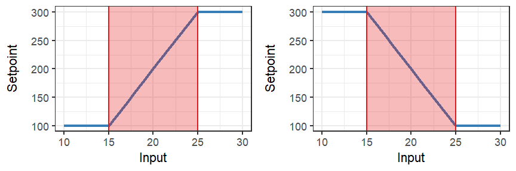

Such proportional setpoints are defined by their range ($[100;300]$ on the y-axis above) in response to an input threshold ($15$ above) and a threshold band ($10$ above). The response can be increasing (left figure) or decreasing (right figure).

Proportional setpoints are written in the notation:
$$
\sp{}{} = x \rightsquigarrow \left[ \sp{x}{};\dsp{x}{}  \right] \mapsto \left[\sp{begin}{}; \sp{end}{} \right]
$$
The two examples above are, respectively,  $x\rightsquigarrow\left[15; 10 \right] \mapsto \left[100; 300 \right]$ and  $x\rightsquigarrow\left[15; 10 \right] \mapsto \left[300; 100 \right]$. *This notation might become handy for scientific publication.*

Hence, a proportional setpoint involves the definition of four setpoints:

* the $x$ threshold $\sp{x}{}$
* the $x$ band $\dsp{x}{}$
* the setpoint value $\sp{begin}{}$ at the beginning of the interval where $x=\sp{x}{}$
* the setpoint value $\sp{end}{}$ at the end of the interval where $x=\sp{x}{}+\dsp{x}{}$.

If the band width is set to zero $\dsp{x}{}=0$ then the setpoint can only be in one of two states, either $\sp{}{}=\sp{begin}{}$ or $\sp{}{}=\sp{end}{}$.

## Humidity setpoint

The humidity setpoint $\sp{H}{max}$ (%) and its proportional band $\dsp{H}{max}$ (%) set the upper limit on indoors relative humidity $H_{in}$ (%). It is used for proportional control of the [heating setpoint](#heating-setpoint) offset and the [ventilation crack setpoint](#ventilation-crack-setpoint).

This boxscript sets the humidity threshold `rhMax` to `80` from May to August and otherwise to `90`. The proportional band is always `5`:

```
Box setpoints {
  Box rhMax {
    PrioritySignal threshold {
      DateTimeSignal {
        .beginDate = 1/5
        .endDate = 31/8
        .signalInside = 80
      }
      DateTimeSignal {
        .beginDate = 1/1
        .endDate = 31/12
        .signalInside = 90
      }
    }
    PrioritySignal band {
      DateTimeSignal {
        .beginDate = 1/1
        .endDate = 31/12
        .signalInside = 5
      }
    }
  }
  :
}
```

The  `rhMac/threshold` box is a `PrioritySignal` box, which means that it will check the boxes inside one by one and pick the first one that should be activated according to the current data (maintained by the `calendar` box; see [Boxscript example with calendar](#boxscript-example-with-calendar)). Here as elsewhere, a lonely `:` denotes left-out lines.

## Heating setpoint

The heating setpoint $\sp{heat}{}$ (&deg;C) is derived from two other setpoints:
* the base heating setpoint $\sp{heat}{base}$ (&deg;C)
* the heating offset at high humidity $\sp{heat}{hum\,offset}$ (&deg;C)

A simple boxscript goes to specify this:

```
Box setpoints {
  :
  Box heating {
    PrioritySignal base {
      DateTimeSignal {
        .beginDate = 1/4
        .endDate = 30/9
        .signalInside = 20
      }
      DateTimeSignal {
        .beginDate = 1/1
        .endDate = 31/12
        .signalInside = 22
      }
    }
    PrioritySignal humidityOffset {
      DateTimeSignal {
        .beginDate = 1/1
        .endDate = 31/12
        .signalInside = 2
      }
    }
  }
}
```

Here `setpoints/heating/base[value]` is `20` from April to September and otherwise `22`. The  `setpoints/heating/huimityOffset[value]` is `2` always. The heating setpoint $\sp{heat}{}$ (&deg;C) will eventually be computed by the [heating controller](#heating-controller) as
$$
\sp{heat}{} = \sp{heat}{base} +\spr{heat}{hum\,offset}
$$
where $\spr{heat}{hum\,offset} \in [0;\sp{heat}{hum\,offset}]$ is the realised humidity offset.

## Average heating setpoint

In average climate control, the base heating setpoint $\sp{heat}{base}$ (&deg;C) is updated regularly (e.g., at midnight) to reflect the average greenhouse temperature $\overline{T_{in}}$  (&deg;C) (e.g., over the last 48 hours). The average heating setpoint $\sp{heat}{avg}$ (&deg;C) regulates $\sp{heat}{base}$ in steps of $\Delta\sp{heat}{base}$ (&deg;C) to keep  $\overline{T_{in}} \approx \sp{heat}{avg}$:  
$$
\text{if}\quad \overline{T_{in}} > \sp{heat}{avg} \quad\text{then}\quad 
\sp{heat}{base} \rightarrow \sp{heat}{base}-\Delta \sp{heat}{base}
\quad\text{else}\quad 
\sp{heat}{base} \rightarrow \sp{heat}{base}+\Delta \sp{heat}{base}
$$

This functionality has not yet been implemented.

## Ventilation setpoint

The ventilation setpoint  $\sp{vent}{}$ (&deg;C) is derived from three other setpoints:

* the [heating setpoint](#heating-setpoint) $\sp{heat}{}$ (&deg;C) 
* the base ventilation offset $\sp{vent}{base\,offset}$ (&deg;C) 
* the ventilation offset at high humidity $\sp{vent}{hum\,offset}$ (&deg;C)

In the boxscript, the humidity offset is given a negative value (here `-1.5`) to ease the handling of setpoints by the [ventilation controller](#ventilation-controller):

```
Box setpoints {
  :
  Box ventilation {
    PrioritySignal baseOffset {
      DateTimeSignal {
        .beginDate = 1/1
        .endDate = 31/12
        .signalInside = 2
      }
    }
    PrioritySignal humidityOffset {
      DateTimeSignal {
        .beginDate = 1/1
        .endDate = 31/12
        .signalInside = -1.5
      }
    }
  }
}

```

The ventilation setpoint $\sp{vent}{}$ (&deg;C) will eventually be computed by the [ventilation controller](#ventilation-controller) as
$$
\begin{equation}
\sp{vent}{} = \sp{heat}{} + \sp{vent}{base\,offset} - \spr{vent}{hum\,offset}
\label{eq_sp_vent}
\end{equation}
$$

where $\spr{vent}{hum\,offset} \in [0;\sp{vent}{hum\,offset}]$ is the realised humidity offset.

## Ventilation crack setpoint

At high indoors humidity $H_{in}$ (%),  ventilation must be kept above a certain minimum; this is the 'ventilation crack' setpoint $\sp{vent\,crack}{}$ (h$^{-1}$). As its unit implies, it a minimum ventilation rate. However, if the outdoors temperature $T_{out}$ (&deg;C) is too low then the ventilation crack is not applied. 

In this boxscript, the ventilation crack has been set to `0.5`. The realised ventilation crack is determined by the [ventilation crack controller,]("#ventilation-crack-controller") governed by the [humidity setpoint](#humidity-setpoint) but also taking into account the `ventilationCrack/temperature` setpoint. In this example, the ventilation crack will keep its full value ($0.5 \text{ h}^{-1}$) down to an outdoors temperature of $-5+3=-2\degree\text{C}$. Below $-5\degree\text{C}$ the ventilation crack will be zero.

```
Box setpoints {
  :
  Box ventilationCrack {
    PrioritySignal size {
      DateTimeSignal {
        .beginDate = 1/1
        .endDate = 31/12
        .signalInside = 0.5
      }
    }
    Box temperature {
      PrioritySignal threshold {
        DateTimeSignal {
          .beginDate = 1/1
          .endDate = 31/12
          .signalInside = -5
        }
      }
      PrioritySignal band {
        DateTimeSignal {
          .beginDate = 1/1
          .endDate = 31/12
          .signalInside = 3
        }
      }
    }
  }
}

```

## Screen crack setpoint

A screen crack setpoint would be defined to ensure that screens would not block the free passage of air through the vents, when ventilation were necessary. However, the ventilation model is not detailed enough to correct for the influence of screens on the effectiveness of the vents. Hence, the model does not include a screen crack setpoint.

## Growth light setpoints

Growth lights are arranged into banks, which each follow their own logic; growth lights in a bank are switched on/off together. A bank can be operating in any of three modes designated by a code (0, 1 or 10):

* 0: growth light is off
* 1: growth light is on only when additional light is needed
* 10: growth light is on

The `mode` is itself a setpoint. Hence, you can change any aspect of the growth light logic through time. 

In the following example there are two banks of setpoints, named `bank1` and `bank2`. Banks can be named freely but the same names must be used in growth light [controllers](#growth-light-controllers) and [actuators](#growth-light-actuators) too; furthermore, a bank most hold a child box called `mode`.

```
Box setpoints {
  :
  Box growthLights {
    Box bank1 {
      PrioritySignal mode {
        DateTimeSignal {
          .beginDate = 01/11
          .endDate   = 30/11
          .beginTime = 06:00:00
          .endTime   = 10:00:00
          .signalInside = 10
        }
        DateTimeSignal {
          .beginDate = 01/10
          .endDate   = 31/12
          .beginTime = 06:00:00
          .endTime   = 18:00:00
          .signalInside = 1
        }
        DateTimeSignal {
          .beginDate = 1/10
          .endDate   = 31/12
          .signalInside = 0
        }
      }
      Box thresholds {
        PrioritySignal low {
          DateTimeSignal {
            .beginDate = 1/1
            .endDate = 31/12
            .signalInside = 40
          }
        }
        PrioritySignal high {
          DateTimeSignal {
            .beginDate = 1/1
            .endDate = 31/12
            .signalInside = 600
          }
        }
      }
    }
    Box bank2 {
      PrioritySignal mode {
        DateTimeSignal {
          .beginDate =  1/10
          .endDate   = 31/02
          .beginTime = 04:00
          .endTime   = 08:00
          .signalInside = 10
        }
        DateTimeSignal {
          .beginDate = 1/1
          .endDate = 31/12
          .signalInside = 0
        }
      }
    }
  }
}
```

The outcome of these setpoints is for `bank1`:

* In November growth lights are on between 6 and 10 a.m.
* In October and December growth lights are on when outdoors light is less than 40 W/m^2^, except when outdoors light is above 600 W/m^2^. 
* All other months growth lights are off.

For `bank2`:

* From October to February growth lights are on between 4 and 8 a.m.
* All other months growth lights are off.

Strictly speaking, it is decided by the growth light [controller](#growth-light-controller) (here the `controllers/growthLights/bank1` controller) which variable the thresholds refer to.

## Chalk setpoint

The glass may be chalked (whitened) to lessen radiative transmission. The setpoint is a number between 0 and 1 allowing for varying strengths of whitening. The actual strength is set by the [chalk controller](#chalk-controller), which makes it possible to reduce whitening strength with time or due to events such as heavy rainfall. The actual, radiative effect of chalking is determined by the [chalk actuator](#chalk-actuator).

The example whitening is fully on from 1 March to 15 April; otherwise it is off:

```
Box setpoints {
  :
  PrioritySignal chalk {
    DateTimeSignal {
      .beginDate = 1/3
      .endDate = 15/4
      .signalInside = 1
    }
    DateTimeSignal {
      .beginDate = 1/1
      .endDate = 31/12
      .signalInside = 0
    }
  }
}
```


## Screen setpoints

Screen setpoints provide setpoint values used by the [screen controllers](#screen-controllers). You should give the setpoint boxes names that will make it easy for you to recall their relations to the screen layers defined in the screen house construction. Please refer to the [Boxscript example with cover and screens](#boxscript-example-with-cover-and-screens)) which we  continue in the boxscript further down.

In general, **energy** screens will need a threshold below which the curtain should drawn (e.g., in response to outdoors radiation), whereas **shade** and **blackout** screens need a threshold above which they will be drawn. Screen setpoints are usually [proportional setpoints](#proportional-setpoints) and thus need a proportional band in addition to the threshold. Both the threshold and the proportional band can be set up with different values for different periods of the year and the day.

### Boxscript example with screen setpoints

In this example, the setpoints are divided into three groups, each held inside one box: `energy`, `shade` and `blackout`. A value is set for a certain period by a `DateTimeSignal` box. For instance, the `shade/threshold` box holds three `DateTimeSignal` boxes (lines 20-37). The  `shade/threshold` box itself is a `PrioritySignal` box, which means that it will check the boxes inside one by one and pick the first one that should be activated according to the current data and time (maintained by the `calendar` box; see [Boxscript example with calendar](#boxscript-example-with-calendar)). The dates `beginDate` and `endDate` are inclusive. In this case, the result will be that the output port `setpoints/shade/threshold[value]` (to spell out the unique path identifying this port) will take on the value `300` in December and January, `400` from 1 February until 15 March and `500` from 16 March until 30 November. Meanwhile, the proportional band at  `setpoints/shade/band[value]` will always be `50`.

For easier reading, you can follow my example and always define a `PrioritySignal` box even though it holds only one `DateTimeSignal`, which is then a given choice. If none of the boxes held by `PrioritySignal` matches the current date and time, it will sets its `value` to zero which is rarely wanted. Hence, it is best always with to have a final `DateTimeSignal` box that spans the whole year.

The `blackout` setpoint (lines 46-70) causes the screen to be on from 1 April to 15 June every night from 4 a.m., when outdoor light is above a threshold value of `2`. Outside this period of the day and of the year, the threshold value is `9999`, i.e. the screen will be off since light (if its in W/m^2^) will never surpass this value.

```
Box setpoints {
  :
  Box screens {
    Box energy {
      PrioritySignal threshold {
        DateTimeSignal {
          .beginDate = 1/1
          .endDate = 31/12
          .signalInside = 5
        }
      }
      PrioritySignal band {
        DateTimeSignal {
          .beginDate = 1/1
          .endDate = 31/12
          .signalInside = 0
        }
      }
    }
    Box shade {
      PrioritySignal threshold {
        DateTimeSignal {
          .beginDate = 1/12
          .endDate = 31/1
          .signalInside = 300
        }
        DateTimeSignal {
          .beginDate = 1/1
          .endDate = 15/3
          .signalInside = 400
        }
        DateTimeSignal {
          .beginDate = 1/1
          .endDate = 31/12
          .signalInside = 500
        }
      }
      PrioritySignal band {
        DateTimeSignal {
          .beginDate = 1/1
          .endDate = 31/12
          .signalInside = 50
        }
      }
    }
    Box blackout {
      PrioritySignal threshold {
        DateTimeSignal {
          .beginDate = 1/4
          .endDate = 15/6
          .beginTime = 04:00
          .endTime   = 12:00
          .signalInside = 2
          .signalOutside = 9999
        }
        DateTimeSignal {
          .beginDate = 1/1
          .endDate = 31/12
          .signalInside = 9999
        }
      }
      PrioritySignal band {
        DateTimeSignal {
          .beginDate = 1/1
          .endDate = 31/12
          .signalInside = 0
        }
      }
    }
  }
}
```

## CO~2~ setpoint

The CO~2~ setpoint sets the desired minimum CO~2~ concentration (ppm). As an example, the boxscript below setpoint sets CO~2~ at 1200 ppm in the summer and at 900 ppm for the rest of the year:

```
Box setpoints {
  :
  Box co2 {
    PrioritySignal concentration {
      DateTimeSignal {
        .beginDate = 15/6
        .endDate = 31/08
        .signalInside = 1200
      }
      DateTimeSignal {
        .beginDate = 1/1
        .endDate = 31/12
        .signalInside = 900
      }
    }
    Box ventilation {
      PrioritySignal threshold {
        DateTimeSignal {
          .beginDate = 1/1
          .endDate = 31/12
          .signalInside = 0.2
        }
      }
      PrioritySignal band {
        DateTimeSignal {
          .beginDate = 1/1
          .endDate = 31/12
          .signalInside = 0.1
        }
      }
    }
  }  
}
```

At high ventilation rates, CO~2~ enrichment is a waste. In the boxscript above, the limit has been set at `0.2` h$^{-1}$ with a [proportional band](#proportional-setpoints) of `0.1` h$^{-1}$. Hence between a ventilation rate of 0.2 h$^{-1}$ up to 0.3 h$^{-1}$, the CO~2~ dispensation rate will dwindle to zero.

The CO~2~ setpoint is passed on to the [CO~2~ controller](#CO2-controller), while the ventilation-dependent limitation is applied directly by the [CO~2~ actuator](#CO2-actuator).

# Controllers

Controllers add further to the logic imposed by [setpoints](#setpoints).

## Heating controller

The heating controller takes the base heating set point and adds the humidity offset for heating. Both values are set by the [heating setpoint](#heating-setpoint).

In the boxscript below, `controllers/heating` is a `Sum` box which adds the base value and the humidity offset (the pipe `|` operator signifies a union of the matches provide by the two paths `setpoints/heating/base[value]` and `./humidityOffset[value]`). 

The offset is calculated by the child box (referred to by a leading period, i.e. `./humidityOffset[value]`), which again is a `ProportionalSignal` governed by the [humidity setpoint](#humidity-setpoint) and the current indoors humidity `indoors[rh]`. Note how the maximum possible offset is grabbed from the setpoint `setpoints/heating/humidityOffset[value]`. The offset is increasing with humidity through the threshold band.

```
Box controllers {
  :
  Sum heating {
    .values = setpoints/heating/base[value] | ./humidityOffset[value]
    ProportionalSignal humidityOffset {
      .input         = indoors[rh]
      .threshold     = setpoints/rhMax/threshold[value]
      .thresholdBand = setpoints/rhMax/band[value]
      .maxSignal     = setpoints/heating/humidityOffset[value]
      .increasingSignal = TRUE
    }
  }
}
```

## Ventilation controller

The ventilation controller works very much like the [heating controller](#heating-controller), except it adds up three values (cf. $\ref{eq_sp_vent}$):

```
Box controllers {
  :
  Sum ventilation {
    .values = controller/heating[value] | 
              setpoints/ventilation/baseOffset[value] | 
              ./humidityOffset[value]
    ProportionalSignal humidityOffset {
      .input         = indoors[rh]
      .threshold     = setpoints/rhMax/threshold[value]
      .thresholdBand = setpoints/rhMax/band[value]
      .maxSignal     = setpoints/ventilation/humidityOffset[value]
      .increasingSignal = TRUE
    }
  }
}
```

The three values are taken from three different sources: the heating controller, the ventilation setpoint and the realised humidity offset computed by its own child box. The [ventilation actuator](#ventilation-actuator) must take both the ventilation controller and the [ventilation crack controller](#ventilation-crack-controller) into account when determining the actual ventilation rate.

## Ventilation crack controller

The `ventilationCrack` controller first restricts the size of the crack by the temperature limitation imposed by outdoors temperature (lines 9-15) (in BoxScript, children are updated before parents). This crack value `./temperatureLimited[value]` is then moderated further by way of the [humidity setpoint](#humidity-setpoint) to arrive at the final crack `controllers/ventilationCrack[value]`.

```
Box controllers {
  :
  ProportionalSignal ventilationCrack {
    .input         = indoors[rh]
    .threshold     = setpoints/rhMax/threshold[value]
    .thresholdBand = setpoints/rhMax/band[value]
    .maxSignal     = ./temperatureLimited[value]
    .increasingSignal = TRUE
    ProportionalSignal temperatureLimited {
      .input         = outdoors[temperature]
      .threshold     = setpoints/ventilationCrack/temperature/threshold[value]
      .thresholdBand = setpoints/ventilationCrack/temperature/band[value]
      .maxSignal     = setpoints/ventilationCrack/size[value]
      .increasingSignal = TRUE
    }
  }
}
```


## Growth light controllers

There may be several growth light controllers, one for each bank of growth lights. A growth light controller switches the growth lights in the bank on/off according to the [growth light setpoints](#growth-light-setpoints). To continue the setpoint example, we can define the following two controllers:

```
Controllers {
  :
  Box growthLights {
    GrowthLightController bank1 {
      .mode           = setpoints/growthLights/bank1/mode[value]
      .thresholdValue = outdoors[radiation]
      .thresholdLow   = setpoints/growthLights/bank1/thresholds/low[value]
      .thresholdHigh  = setpoints/growthLights/bank1/thresholds/high[value]
      .minPeriodOn    = 5.
    }
    GrowthLightController bank2 {
      .mode           = setpoints/growthLights/bank2/mode[value]
      .minPeriodOn    = 30.
    }
  }
}
```

Due to the complicated control logic, a dedicated `GrowthLightController` is needed for each bank. The `bank1` controller refers to the `bank1` setpoints (lines 5, 7 and 8) and likewise for `bank2` (line 12).  Only `bank1` needs the inputs `thresholdValue`, `thresholdLow` and `thresholdHigh`; `bank2` is not threshold-controlled. The optional `minPeriodOn` can be set to obtain a certain minimum periods (in minutes) for the lights being switched on.

## CO~2~ controller

The CO~2~ controller is a [PID controller](https://en.wikipedia.org/wiki/PID_controller) which controls the CO~2~ injection system to regulate the CO~2~ towards the [CO~2~ setpoint](#co2-setpoint).

A `PidController` box has three  parameters:

* `Kprop` for proportional (P) control
* `Kint` for integral (I) control
* `Kderiv` for derivate (D) control

These are used to steer the `sensedValue` towards the `desiredValue`. This boxscript provides an example in which only proportional control `Kprop` is applied:

```
Box controllers {
  :
  Box co2 {
    &change = ./controller[controlVariable]
    PidController controller {
      .sensedValue = indoors/co2[value]
      .desiredValue = setpoints/co2[value]
      .Kprop = 0.05
    }    
  }
}
```

`PidController` produces the `controlVariable` output which tends towards zero, when the P+I+D terms tend towards a zero sum. Here, it used as an indicator how much the CO~2~ injection rate should change (line 4). The `co2[change]` output is used as an input by the [CO~2~ actuator](#CO2-actuator).

## Screen controllers

The screen controllers use the [screen setpoints](#screen-setpoints) together with inputs provided, e.g., from the `outdoors` box to compute desired screen states between 0 (fully off) to 1 (fully on). As mentioned earlier, there is no [screen crack setpoint](#screen-crack-setpoint) to take into account.

### Boxscript example with screen controllers

With the definitions given in the [boxscript example with screen setpoints](#boxscript-example-with-screen-setpoints), we could write the following three controllers, which all responds to outdoors radiation (W/m^2^) provided by `outdoors[radiation]`:

```
Box controllers {
  :
  Box screens {
    ProportionalSignal energy {
      .input         = outdoors[radiation]
      .threshold     = setpoints/screens/energy/threshold[value]
      .thresholdBand = setpoints/screens/energy/band[value]
      .maxSignal = 1
      .increasingSignal = FALSE
    }
    ProportionalSignal shade {
      .input         = outdoors[radiation]
      .threshold     = setpoints/screens/shade/threshold[value]
      .thresholdBand = setpoints/screens/shade/band[value]
      .maxSignal = 1
      .increasingSignal = TRUE
    }
    ProportionalSignal blackout {
      .input         = outdoors[radiation]
      .threshold     = setpoints/screens/blackout/threshold[value]
      .thresholdBand = setpoints/screens/blackout/band[value]
      .maxSignal = 1
      .increasingSignal = TRUE
    }
  }
}
```

Note how the `increasingSignal` input tells whether the `signal` computed by a `ProportionalSignal` box is increasing or decreasing in response to the input. There is also a `minSignal` input but this defaults to `0`, which is just what we want.

All boxes of the `Signal` classes (`ProportionalSignal`, `PrioritySignal`, *etc.*) provide their about under two equivalent names, `value` and `signal`.

## Chalk controller

The chalk controller may provide mechanisms to modulate the whitening strength set by the [chalk setpoint](#chalk-setpoint). Most simply it just passes on the setpoint:

```
Box controllers {
  :
  Box chalk {
    &value = controllers/chalk[value]
  }
}
```

The [chalk actuator](#chalk-actuator) retrieves the current whitening strength from `/controllers/chalk[value]`.

# Actuators

## Growth light actuators

Each bank of growth lights is controlled by a [growth light controller](#growth-light-controllers) for which there exists a growth light actuator with the same name (e.g., `bank1`, `bank2`)

 A growth light actuator is described by the parameters:

* installed lamp power $P_{lamp}$ (W/m^2^)
* optimal PAR efficiency $\epsilon_{lamp}^{opt}$ (μmol PAR/J)
* efficiency correction $\epsilon_{lamp}^{age}\in[0;1]$
* proportion of emitted radiation that is long-waved $p_{lamp}^{lw}\in[0;1]$
* ballast $P_{ballast}$ (W/m^2^)

The efficiency of lamps will degrade with their age. The product $\epsilon_{lamp}^{opt} \epsilon_{lamp}^{age}$ expresses the actual efficiency. 

See the [Growth light layer](#growth-light-layer) section for details on growth light function. Then outputs of all sets of growth lights are added and considered one [layer](#layers).

```
Box actuators 
  :
  Box growthLights {
    ActuatorGrowthLight bank1 {
      .isOn = controllers/growthLights/bank1[isOn]
      .power = 100
      .parPhotonCoef = 2.5
      .efficiency = 1.0
      .propLw = 0.1
      .ballast = 0
    }
    ActuatorGrowthLight bank2 {
      .isOn    = controllers/growthLights/bank2[isOn]
      .power = 80
      .parPhotonCoef = 1.6
      .efficiency = 0.8
      .propLw = 0.3
      .ballast = 10
    }
  }

```


## Screen actuators

Each screen actuator is governed by a [controller](#screen-controllers).  It has a `lagPeriod` input, which is the time taken (in minutes) to drag the screen all the way from position 0 to 1 (or from 1 to 0). If the lag period is much smaller than the simulation time step, it is better to set it to zero to avoid unrealistic delays in effectuating screen settings.

### Boxscript example with screen actuators

To continue the [boxscript example with screen controllers](#boxscript-example-with-screen-controllers), we could write

```
Box actuators {
  :
  Box screens {
    ActuatorScreen energy {
      .position = controllers/screens/energy[value]
      .lagPeriod = 10
    }
    ActuatorScreen shade {
      .position = controllers/screens/shade[value]
      .lagPeriod = 10
    }
    ActuatorScreen blackout {
      .position = controllers/screens/blackout[value]
      .lagPeriod = 10
    }
  }
}
```


## Heat pipe actuators

There can be several sets of of heat pipes installed. Each set of heat pipes is described by the parameters:

* water volume in pipe $V_{pipe}$ (m^3^)
* water flow rate $\dot{v}_{pipe}$ (m^3^/h)
* calibration parameters $k$ and $b$
* proportion of heat emitted is long-waved radiation $p_{pipe}^{lw}\in[0;1]$

See the [Heat pipe layer](#heat-pipe-layer) section for details on heat pipe function. Then outputs of all sets of heat pipes are added and considered one [layer](#layers).

The actual pipe inlet temperature $T_{pipe}^{inlet}$ (&deg;C) is governed by the [energy budget](#energy-budget) model according to the relevant [controllers](#controllers).

## Ventilation actuator

Vents are characterised by their width and length and the number of vents installed. If vents of different dimensions are installed, they are specified as different sets. The total area of vents $A_{vent}$ (m^2^) is used to calculate the maximum ventilation rate $v_{max}$ (h$^{-1}$) (eq. $\ref{eq_vent_max}$). Due to the simplicity of the ventilation model, no specification is needed for the position of the vents.

The actual ventilation rate $v$ (h$^{-1}$) (see [advection](#advection)) is governed by the [energy budget](#energy-budget) model according to the relevant [controllers](#controllers).

## CO~2~ actuator

The CO~2~ actuator injects CO~2~ at a rate of $c_{CO2}$ (g/m^2^/h). The actuator is limited by its maximum injection capacity $C_{CO2}$ (g/m^2^/h). In the boxscript below it has been set to `60`:

```
Box actuators {
  :
  Box co2 {
    &injectionRate = ./injectionRate[value]
    Accumulator injectionRate {
      .change = controllers/co2/injectionRate[change]
      .minValue = 0
      .maxValue = ./injectionRate[value]
      ProportionalSignal injectionrate {
        .input         = actuators/ventilation[value]
        .threshold     = setpoints/co2/ventilation/threshold[value]
        .thresholdBand = setpoints/co2/ventilation/band[value]
        .maxSignal     = 60
        .increasingSignal = FALSE
      }
    }
  }
}
```

When deciphering this boxscript, remember that boxscripts are interpreted child-first. Hence `injectionRate` in lines 9-15 comes first. Here, the maximum injection rate is adjusted for the current ventilation rate, which might limit it below the set maximum of `60` (line 13). This value is taken by the parent box (lines 5-16) as an input (line 8) to set the maximum ventilation rate arrived at by PID control. `Accumulator` is a box that in every time step adds the `change` input (line 6) to its current `value`. The value can, however, never exceed the bounds set by `minValue` and `maxValue` (lines 7-8). The `change` input was computed by the [CO~2~ controller](#co2-controller) by PID control. The resulting `value`is finally set as the `injectionRate` in line 4. Thus the [CO~2~ budget model](#co2-budget) can retrieve the current CO~2~ injection rate from the port `actuators/co2[injectionRate]`.

## Chalk actuator

The current strength of whitening ($\epsilon_{chalk} \in [0;1]$) is provided by the [chalk controller](#chalk-controller). In addition, the chalk actuator takes two parameters for the additional reflectivity provided by the whitening, $\rho_{chalk}^{sw} \in [0;1]$ and $\rho_{chalk}^{lw} \in [0;1]$ for short-wave and long-wave radiation, respectively. The corrections, $\epsilon_{chalk}^{sw}\,\rho_{chalk}$ and $\epsilon_{chalk}\,\rho_{chalk}^{lw}$,  are applied to the cover of all six greenhouse faces for both incoming and outgoing radiation.

As an example, if the [cover](#cover_layer) has the properties $\rho^{sw}=0.1$, $\tau^{sw}=0.8$ and $\alpha^{sw}=0.1$, and the chalk effect is $\epsilon_{chalk}\,\rho_{chalk}^{sw}=0.2$ then the corrected properties of the cover for incoming radiation will be $\rho^{sw}=0.1+0.2=0.3$, $\tau^{sw}=0.8-0.2=0.6$ and $\alpha^{sw}=0.1\text{.}$ Likewise, for the parameters for outgoing radiation. The actuator enforces limits to ensure that the corrected properties are all between 0 and 1, and that they sum up to 1.

Here is a boxscript example:

```
Box actuators {
  :
  ActuatorChalk chalk {
    .state = controllers/chalk[value]
    .swReflectivity = 0.2
    .lwReflectivity = 0.1
  }
}
```

# Budgets

## Energy budget

We build the energy budget by adding the [processes of heat exchange](#processes-of-heat-exchange) one by one. The step-wise construction is reflected in R scripts that progressively includes more and more of the energy budget.

### Sources of radiation

Radiation enters the model as layers may emit radiation downwards from the bottom $(E_i^{sw}, E_i^{par}, E_i^{lw})$ and upwards from the top $({E_i^{sw}}', {E_i^{par}}', {E_i^{lw}}')$. While only some layers act as a primary source of short-wave radiation radiation (sky and growth lights), all layers may transmit and reflect short-wave radiation received from neighbouring layers. In contrast, all layers are primary sources of long-wave radiation. For most layers, the long-waved radiation is determined by the Stefan-Boltzmann Law (eq. $\ref{stefan_boltzmann}$) ('S-B Law' in the table below).$

The primary emission plus the transmitted and reflected radiation defines the net flows of radiation downwards $(F_i^{sw}, F_i^{par}, F_i^{lw})$ and upwards $({F_i^{sw}}', {F_i^{par}}', {F_i^{lw}}')$ from each layer. For the sky, all upwards radiation is zero ${E_i^r=0}'$; likewise for the floor, all downwards radiation is zero $E_i^r=0$.

| Layer        | Temperature<br />$(T_i)$         | Short-waved radiation<br />$(E_i^{sw}, {E_i^{sw}}', E_i^{par}, {E_i^{par}}')$ | Long-waved radiation<br />$(E_i^{lw}, {E_i^{lw}}')$ |
| ------------ | -------------------------------- | ------------------------------------------------------------ | --------------------------------------------------- |
| Sky          | *driving variable*               | *driving variable*                                           | $f(T_i)$ (S-B Law)                                  |
| Cover        | *state variable*, $f(\dot{H}_i)$ | 0                                                            | $f(T_i)$ (S-B Law)                                  |
| Screen       | *state variable*, $f(\dot{H}_i)$ | 0                                                            | $f(T_i)$ (S-B Law)                                  |
| Growth light | *n.a.*                           | *state variable*, $f(\cdot)$                                 | *state variable*, $f(\cdot)$                        |
| Plant canopy | *state variable*, $f(\cdot)$     | 0                                                            | $f(T_i)$ (S-B Law)                                  |
| Heat pipe    | *state variable*, $f(\cdot)$     | 0                                                            | *state variable*, $f(\cdot)$                        |
| Floor        | *state variable*, $f(\dot{H}_i)$ | 0                                                            | $f(T_i)$ (S-B Law)                                  |

For the sky both its temperature and short-wave emission are driving variables (usually read from a weather log file). Its downward long-wave emission is calculated from its temperature. 

For cover, screen and floor layers, temperature is updated according to the heat balance $\dot{H}_i$ (W/m^2^) and the heat capacity $C_i$ (J/K/m^2^),
$$
\Delta T_i = \frac{\dot{H}_i\Delta t}{C_i}
$$
where $\Delta t$ (s) is the simulation time step and $\Delta T_i$ (K) is the change in layer temperature.

For growth light, temperature is not tracked. A dedicated sub-model, denoted as a function with numerous inputs $f(\cdot)$, computes the emission of radiation (short-waved, PAR and long-waved). Dedicated sub-models also calculated the temperature of the canopy and heat pipe layers, as well as the long-waved radiation emitted from heat pipes.

### Short-wave radiation

As radiation is emitted, absorbed, reflected and transmitted by the layers, a net radiation flux will result downwards and upwards for each layer $i$. The following algorithm, here applied to short-wave radiation, will also be used for long-wave radiation and PAR.

The net radiation fluxes throughout the stack of layers are resolved by resolving them two layers at a time. Consider layer $i$ on top of the layer $i+1$ below:


Our first aim is to find out, how much of the downwards radiation from the upper layer $F_i$ (W/m^2^), e.g $F_i^{sw}$, is absorbed by the lower layer? If we denote the *net* absorption from above  $\hat{\alpha}_{i+1}$, we immediately have
$$
\hat{\alpha}_{i+1} = \alpha_{i+1}
$$
However, a fraction of the light will be reflected by the upperside of the lower layer ($\rho_{i+1}$) and then re-reflected from the underside of the upper layer ($\rho_i'$). We must add that bit,
$$
\hat{\alpha}_{i+1} = \alpha_{i+1} + \alpha_{i+1}\rho_{i+1}\rho_i'
$$
and so forth as photons keep bouncing between the two layers,
$$
\hat{\alpha}_{i+1} = \alpha_{i+1} + \alpha_{i+1}\left(\rho_{i+1}\rho_i'\right)^1 + \alpha_{i+1}\left(\rho_{i+1}\rho_i'\right)^2 + \ldots
=\alpha_{i+1}\sum_{j=0}^\infty \left(\rho_{i+1}\rho_i'\right)^j
$$
Since the reflectivies are less than one, the infinite series will converge as
$$
r_i = \sum_{j=0}^\infty \left(\rho_{i+1}\rho_i'\right)^j=\frac{1}{1-\rho_{i+1}\rho_i'}
$$
and we get the amount absorbed by the lower layer $A_{i+1}$ (W/m^2^),
$$
A_{i+1} = \hat{\alpha}_{i+1}F_i = r_i\alpha_{i+1}F_i
$$
The net transmission through the lower layer $\hat\tau_{i+1}$ follows the same logic and we arrive at
$$
\hat\tau_{i+1} = r_i\tau_{i+1}
$$
On every bounce of the radiation, fractions will be lost to absorption by and transmission through the upper layer. Thus the calculations for the underside of the upper layer are the same, except that the we start out with what's first reflected upwards from the lower layer ($\rho_{i+1}$). Hence, we get
$$
\begin{split}
\hat\alpha_i' &= \rho_{i+1}r_i\alpha_i' \\[6pt]
\hat\tau_i    &= \rho_{i+1}r_i\tau_i'
\end{split}
$$
One consequence of these reflections is that part of the downwards radiation from the upper layer $F_i$ will be absorbed by the layer itself from below $A_i'$ (W/m^2^):
$$
A_i' = \hat\alpha_i'F_i = \rho_{i+1} r_i\alpha_{i+1}F_i
$$
Let's check that we have now accounted for the fate all radiation downwards from layer $i$. We have split it into radiation absorbed by and transmitted through either of the to layers. In total we get
$$
\begin{split}
\hat\alpha_{i+1}+\hat\tau_{i+1}+\hat\alpha_i'+\hat\tau_i' &= \\[6pt]
\frac{\alpha_{i+1}+\tau_{i+1}+\rho_{i+1}(\alpha_i'+\tau_i')}{1-\rho_{i+1}\rho_i'}&= \\[6pt]
\frac{(1-\rho_{i+1})+\rho_{i+1}(1-\rho_i')}{1-\rho_{i+1}\rho_i'}&= \\[6pt]
\frac{1-\rho_{i+1}+\rho_{i+1}-\rho_{i+1}\rho_i'}{1-\rho_{i+1}\rho_i'}&= 1
\end{split}
$$
Thus we have accounted for it all.

Having accounted for the fate of the downwards radiation from layer $i$, we can now repeat the calculation for the next pair of layers, $i+1$ and $i+2$, and so forth until the bottom of the stack. The downwards flow from any layer $i$ is the inherent emission $E_i$ (i.e. for a layer of growth lights) plus the transmission from the layer above $\hat\tau_iF_{i-1}$,
$$
F_i=E_i + \hat\tau_iF_{i-1}
$$
After we have finished the distribution of downwards radiation, we repeat the procedure this time going from the bottom to the top following the upwards radiation,
$$
F_i' = E_i' + \hat\tau_i'F_{i+1}'
$$
We repeat the calculations downwards-upwards, on each pass accumulating in each  layer the radiation absorbed from above $A_i$ and below $A_i'$. The calculation stops when nearly all radiation has been absorbed, e.g. until $\sum_i F_i+\sum_i F_i' < 10^{-6}$  W/m^2^. Note that the inherent emission downwards $E_i$ and upwards $E_i'$ is only added to the respective flows,  $F_i$ and  $F_i'$, on the first pass through the calculations.

#### PAR

The PAR budget is resolved just as the short-wave budget above. However, PAR is not part of the energy budget. Its only role is to provide energy for photosynthesis in the canopy layer. It needs a special treatment because the emission of PAR $(E_i^{par}, {E_i^{par}}')$ and short-wave radiation $(E_i^{sw}, {E_i^{sw}}')$ will  differ between layers, such us sky and growth lights.

#### Computation example

The `1-energy-budget-sw.R` script demonstrates the calculations. Here the light layer emits 100 W/m^2^ downwards (or 100 &#956;mol/m^2^/s; the calculations are the exact same). The zero emission of short-wave radiation from the sky indicates a night situation. Greek letters are represented by their Latin equivalent and primes have been replaced by underscores:

```
        Layer    a    r    t   a_   r_   t_   E E_   F F_ A A_
1         Sky 1.00 0.00 0.00 1.00 0.00 0.00   0  0   0  0 0  0
2       Glass 0.03 0.08 0.89 0.03 0.08 0.89   0  0   0  0 0  0
3      Screen 0.10 0.60 0.30 0.10 0.60 0.30   0  0   0  0 0  0
4       Light 0.00 0.00 1.00 0.00 0.00 1.00 100  0 100  0 0  0
5       Plant 0.71 0.05 0.24 0.71 0.05 0.24   0  0   0  0 0  0
6     Heating 0.00 0.00 1.00 0.00 0.00 1.00   0  0   0  0 0  0
7       Floor 0.60 0.40 0.00 1.00 0.00 0.00   0  0   0  0 0  0
```

The radiative parameters for the plant layer was computed for $L_{ai}=1.9$ and $k=0.65$ giving $\alpha=0.71$, $\rho=0.05$ and $\tau=0.24$ (eqs. $\ref{eq_rho}$ to $\ref{eq_tau}$).

After the first distribution of radiation downwards, we have

```
        Layer    a    r    t   a_   r_   t_   E E_ F  F_    A A_
1         Sky 1.00 0.00 0.00 1.00 0.00 0.00   0  0 0 0.0  0.0  0
2       Glass 0.03 0.08 0.89 0.03 0.08 0.89   0  0 0 0.0  0.0  0
3      Screen 0.10 0.60 0.30 0.10 0.60 0.30   0  0 0 0.0  0.0  0
4       Light 0.00 0.00 1.00 0.00 0.00 1.00 100  0 0 5.0  0.0  0
5       Plant 0.71 0.05 0.24 0.71 0.05 0.24   0  0 0 0.0 71.0  0
6     Heating 0.00 0.00 1.00 0.00 0.00 1.00   0  0 0 9.6  0.0  0
7       Floor 0.60 0.40 0.00 1.00 0.00 0.00   0  0 0 0.0 14.4  0
```

We can see that $71.0 + 14.4 = 85.4\%$ of the radiation has been absorbed by plants and floor together, while $5.0+9.6=14.6\%$ has been reflected upwards by the same layers. We carry on distributing these $14.6\%$ upwards and get

```
        Layer    a    r    t   a_   r_   t_   E E_   F F_    A  A_
1         Sky 1.00 0.00 0.00 1.00 0.00 0.00   0  0 0.0  0  0.0 2.0
2       Glass 0.03 0.08 0.89 0.03 0.08 0.89   0  0 0.0  0  0.0 0.1
3      Screen 0.10 0.60 0.30 0.10 0.60 0.30   0  0 0.1  0  0.0 0.7
4       Light 0.00 0.00 1.00 0.00 0.00 1.00 100  0 4.4  0  0.0 0.0
5       Plant 0.71 0.05 0.24 0.71 0.05 0.24   0  0 0.0  0 71.0 6.8
6     Heating 0.00 0.00 1.00 0.00 0.00 1.00   0  0 0.5  0  0.0 0.0
7       Floor 0.60 0.40 0.00 1.00 0.00 0.00   0  0 0.0  0 14.4 0.0
```

This led to a total of $2.0+0.1+0.7+6.8=9.6\%$ (`A_` column) being absorbed on the underside of various layers (sky, glass, screen, plant). Meanwhile, reflection downwards led to the remaining radiation of $0.1+4.4+0.5=5.0\%$ (`F` column) hitting som layers (screen, light, heating) from above.

If we set the precision, so that the calculations down and up will be repeated until $\sum F_i+\sum F_i'<10^{-6}$ W/m^2^, it turns out that seven iterations are needed, and we get the final distribution,

```
        Layer    a    r    t   a_   r_   t_   E E_ F F_    A  A_
1         Sky 1.00 0.00 0.00 1.00 0.00 0.00   0  0 0  0  0.0 2.2
2       Glass 0.03 0.08 0.89 0.03 0.08 0.89   0  0 0  0  0.0 0.1
3      Screen 0.10 0.60 0.30 0.10 0.60 0.30   0  0 0  0  0.0 0.8
4       Light 0.00 0.00 1.00 0.00 0.00 1.00 100  0 0  0  0.0 0.0
5       Plant 0.71 0.05 0.24 0.71 0.05 0.24   0  0 0  0 74.3 7.3
6     Heating 0.00 0.00 1.00 0.00 0.00 1.00   0  0 0  0  0.0 0.0
7       Floor 0.60 0.40 0.00 1.00 0.00 0.00   0  0 0  0 15.4 0.0
```

Thus $74.3+7.3=81.6\%$ of the radiation ended up in the plant canopy (which is the intended target of growth lights). Most of the remaining light was absorbed by the floor $(15.4\%)$, while only little ended up in glass and screen. Only $2.2\%$ escaped to the sky; this is the light that you can see passing a greenhouse at night. 

### Long-wave radiation

The same algorithm as for short-wave radiation above is used to resolve the fate of long-wave radiation, i.e. its distributed among the layers. However, the absorption of radiation (both short-wave and long-wave radiation) will cause a change in the temperature of the layer $T_i$ (&deg;C) according to its heat capacity $C_i$ (J/K/m^2^). This is taken into account by an additional step in the algoritm, which updates layer temperature as radiation is absorbed.

Note that the distribution of short-wave radiation remains constant because it is temperature-independent. Only the long-wave emission of the layers will change and converge, as a solution is found in which all temperatures are stable and by that, the heat exchange by radiation is in a steady state.

#### Computation example

The `2-energy-budget-lw.R` script demonstrates the calculations, which follow the same logic as for short-wave radiation above but with some extra parameters and calculation steps.

##### Step 1. Initial set-up

Here is the initial set-up. Columns `T` and `C` have been added to hold temperature and heat capacity. Incidentally, $C_{glass}$ was set to $8\,400$ J/m^2^/K by a mistake. The intention was to be consistent with the example in eq. $\ref{eq_c_glass}$, where it is found to be $10\,416$ J/m^2^/K.

```
        Layer    a    r   t   a_   r_  t_   T     C     E    E_    A  A_
1         Sky 0.00 0.00 1.0 1.00 0.00 0.0 -10   Inf 271.9   0.0  0.0 2.2
2       Glass 0.88 0.12 0.0 0.88 0.12 0.0  15  8400 344.0 344.0  0.0 0.1
3      Screen 0.07 0.93 0.0 0.57 0.43 0.0  18  2280 232.3  28.5  0.0 0.8
4       Light 0.00 0.00 1.0 0.00 0.00 1.0  NA   Inf  15.0  15.0  0.0 0.0
5       Plant 0.79 0.01 0.2 0.79 0.01 0.2  24   Inf 349.3 349.3 74.3 7.3
6     Heating 0.00 0.00 1.0 0.00 0.00 1.0  NA   Inf  75.0  75.0  0.0 0.0
7       Floor 0.60 0.40 0.0 0.00 0.00 1.0  12 42000   0.0 224.9 15.4 0.0
```

We have transferred the absorbed short-wave radiation from the example above (columns `A` and `A_`). The emissions (`E` and `E_`) have been set according to layer temperatures and emissivities, applying Stefan-Boltzmann's Law (eq. $\ref{stefan_boltzmann}$), except for light and heating layers. The long-wave emission from light (15 W/m^2^ both up and down) and heating (75 W/m^2^ both up and down) would in the full model be calculated by specific sub-models (see [growth light](#growth-light-layer) and [heating](#heat-pipe-layer)). Note that we use absorptivity as a stand-in for emissivity (see [layers](#layers)). 

The radiative parameters for the plant layer was computed for $L_{ai}=1.9$ and $k=1.0$ (leaves are impenetrable ('black') to long-wave radiation) giving $\alpha=0.79$, $\rho=0.01$ and $\tau=0.20$ (eqs. $\ref{eq_rho}$ to $\ref{eq_tau}$). Glass, likewise transmit no long-wave radiation $\tau=0$.

It worth noting that screens may have an asymmetric emissivity for long-wave radiation ($\epsilon_i^{lw} \neq {\epsilon_i^{lw}}'$). Here we used the radiative parameters exemplified earlier (see [screen layer](#screen-layer)); however, $C_{screen}=2\,280$ J/m^2^/K indicates a sturdier material than the  example shown in eq. $\ref{eq_c_screen}$.  A sky emissivity of 1 ($\alpha_{sky}'=1$) suggests a sky with no cloud cover.

The temperature of layers that have been given an infinite heat capacity, does not change in temperature  by the absorbed radiation. However, the plant temperature is kept fixed in this budget for now, until we have included the full plant canopy sub-model (see [canopy temperature](#canopy-temperature)), which among other things calculates leaf temperature.

##### Step 2. Absorb radiation

We use the same algorithm as for [short-wave radiation](#short-wave-radiation) to distribute the flows of long-wave radiation. We arrive at this solution of the long-wave plus short-wave radiation budget:

```
        Layer    a    r   t   a_   r_  t_   T     C     E    E_     A    A_
1         Sky 0.00 0.00 1.0 1.00 0.00 0.0 -10   Inf 271.9   0.0   0.0 378.8
2       Glass 0.88 0.12 0.0 0.88 0.12 0.0  15  8400 344.0 344.0 239.3 345.2
3      Screen 0.07 0.93 0.0 0.57 0.43 0.0  18  2280 232.3  28.5  27.4 268.8
4       Light 0.00 0.00 1.0 0.00 0.00 1.0  NA   Inf  15.0  15.0   0.0   0.0
5       Plant 0.79 0.01 0.2 0.79 0.01 0.2  24   Inf 349.3 349.3 429.4 408.3
6     Heating 0.00 0.00 1.0 0.00 0.00 1.0  NA   Inf  75.0  75.0   0.0   0.0
7       Floor 0.60 0.40 0.0 0.00 0.00 1.0  12 42000   0.0 224.9 326.9   0.0
```

We left step 1 with $\sum A_i+\sum A_i'=100$ W/m^2^ (columns `A` and `A_`) and $\sum E_i+\sum E_i'=2\,324.2$ W/m^2^ (columns `E` and `E_`). After step 2 the long-wave emission has been added, and we have $\sum A_i+\sum A_i'=2\,424.2$ W/m^2^.

##### Step 3. Update temperature

The net absorbed radiation for any layer $A_i^{rad}$ is found by subtracting the emission from the absorption. For example, we have for the glass layer ($i=2$),
$$
A_2^{rad} = A_2+A_2'-E_2-E_2' = 239.3+345.2-344.0-344.0=-103.5\text{ W/m}^2
$$
How much of a change in glass temperature this will cause, depends on the time step. Let's say the simulation time step for the whole model is  $\Delta t=180 \text{ s}$ but that we sub-divide this into $n$ smaller time steps, when computing the energy budget to improve the numerical precision. With $n=6$ we achieve a change in glass temperature $\Delta T_2$ (K) of
$$
\Delta T_2 = \frac{A_2^{rad}}{C_2} \frac{\Delta t}{n}=
\frac{-103.5 \text{ W/m}^2}{8\,400\text{ J/K/m}^2}\cdot
\frac{180\text{ s}}{6} =
-0.37 \text{ K}
$$
In general, we should set $n$ small enough to achieve an acceptable, small $|\Delta T_i|$ for all $i$. To obtain a fast execution time, we can adjust $n$ in every simulation time step as needed. If we want a maximum temperature change of, say, $0.5$ K in all layers, we can find $n$ by 
$$
n=\left\lceil \frac{max(|\Delta T_i|)}{0.5\text{ K}} \right\rceil
$$
where $\Delta T_i$ are the temperature changes calculated with $n=1$. The ceiling operators $\lceil ... \rceil$ round up to the nearest integer. This is how $n=6$ was determined for this example.

We update the temperature of screen and floor in the same manner and get

```
        Layer    a    r   t   a_   r_  t_     T     C     E    E_ A A_
1         Sky 0.00 0.00 1.0 1.00 0.00 0.0 -10.0   Inf 271.9   0.0 0  0
2       Glass 0.88 0.12 0.0 0.88 0.12 0.0  14.6  8400 344.0 344.0 0  0
3      Screen 0.07 0.93 0.0 0.57 0.43 0.0  18.5  2280 232.3  28.5 0  0
4       Light 0.00 0.00 1.0 0.00 0.00 1.0    NA   Inf  15.0  15.0 0  0
5       Plant 0.79 0.01 0.2 0.79 0.01 0.2  24.0   Inf 349.3 349.3 0  0
6     Heating 0.00 0.00 1.0 0.00 0.00 1.0    NA   Inf  75.0  75.0 0  0
7       Floor 0.60 0.40 0.0 0.00 0.00 1.0  12.1 42000   0.0 224.9 0  0
```

In summary, the glass was cooled by 0.37 K, while screen and floor was heated by 0.48 K and 0.08 K, respectively, during the 30 s time step. The net absorption by the plant canopy is ignored for now. The absorption columns `A` and `A_` have been set to zero too reflect that the absorbed energy has been transformed to heat.

##### Step 4. Update long-wave emission

Since the temperature of glass, screen and floor has changed, we must update their long_wave emission in columns `E` and `E_`:

```
        Layer    a    r   t   a_   r_  t_     T     C     E    E_ A A_
1         Sky 0.00 0.00 1.0 1.00 0.00 0.0 -10.0   Inf 271.9   0.0 0  0
2       Glass 0.88 0.12 0.0 0.88 0.12 0.0  14.6  8400 342.2 342.2 0  0
3      Screen 0.07 0.93 0.0 0.57 0.43 0.0  18.5  2280 233.7  28.7 0  0
4       Light 0.00 0.00 1.0 0.00 0.00 1.0    NA   Inf  15.0  15.0 0  0
5       Plant 0.79 0.01 0.2 0.79 0.01 0.2  24.0   Inf 349.3 349.3 0  0
6     Heating 0.00 0.00 1.0 0.00 0.00 1.0    NA   Inf  75.0  75.0 0  0
7       Floor 0.60 0.40 0.0 0.00 0.00 1.0  12.1 42000   0.0 225.2 0  0
```

##### Step 5. Keep invariant emissions

The short-wave absorption is unaltered and is once again (as in step 1) entered into columns `A` and `A_`. Likewise, the long-wave radiation of light and heating remain unchanged in columns `E` and `E_`:

```
        Layer    a    r   t   a_   r_  t_     T     C     E    E_    A  A_
1         Sky 0.00 0.00 1.0 1.00 0.00 0.0 -10.0   Inf 271.9   0.0  0.0 2.2
2       Glass 0.88 0.12 0.0 0.88 0.12 0.0  14.6  8400 342.2 342.2  0.0 0.1
3      Screen 0.07 0.93 0.0 0.57 0.43 0.0  18.5  2280 233.7  28.7  0.0 0.8
4       Light 0.00 0.00 1.0 0.00 0.00 1.0    NA   Inf  15.0  15.0  0.0 0.0
5       Plant 0.79 0.01 0.2 0.79 0.01 0.2  24.0   Inf 349.3 349.3 74.3 7.3
6     Heating 0.00 0.00 1.0 0.00 0.00 1.0    NA   Inf  75.0  75.0  0.0 0.0
7       Floor 0.60 0.40 0.0 0.00 0.00 1.0  12.1 42000   0.0 225.2 15.4 0.0
```

##### Following steps

After step 5 we return to step 2 and loop through the calculations, step 2 to 5, for a total of $n=6$ iterations to achieve the final result after $\Delta t=180$ s:

```
        Layer    a    r   t   a_   r_  t_     T     C     E    E_ A A_
1         Sky 0.00 0.00 1.0 1.00 0.00 0.0 -10.0   Inf 271.9   0.0 0  0
2       Glass 0.88 0.12 0.0 0.88 0.12 0.0  12.9  8400 335.6 335.6 0  0
3      Screen 0.07 0.93 0.0 0.57 0.43 0.0  20.5  2280 239.1  29.4 0  0
4       Light 0.00 0.00 1.0 0.00 0.00 1.0    NA   Inf  15.0  15.0 0  0
5       Plant 0.79 0.01 0.2 0.79 0.01 0.2  24.0   Inf 349.3 349.3 0  0
6     Heating 0.00 0.00 1.0 0.00 0.00 1.0    NA   Inf  75.0  75.0 0  0
7       Floor 0.60 0.40 0.0 0.00 0.00 1.0  12.4 42000   0.0 226.1 0  0
```

##### Verification

The total net absorption for any layer $i$ over the the $j=1..n$ minor time steps $\Delta A_i^{net}$ (J/m^2^) is
$$
\begin{equation}
\Delta A_i^{net} = \frac{\Delta t}{n}\sum_{j=1}^n A_{ij}^{sw}+{A_{ij}^{sw}}'+A_{ij}^{lw}+{A_{ij}^{lw}}' - 
E_{ij}^{lw}-{E_{ij}^{lw}}'
\label{eq_net_abs_lw}
\end{equation}
$$
where we for convenience have left out the emission of short-wave radiation, which amounts to
$$
E_{ij}^{sw}+{E_{ij}^{sw}}'=-100 \text{ W/m}^2
$$
The energy accumulated by the sky and plant layers were $A_1^{net}=18\,471 \text{ J/m}^2$ and $A_5^{net}=25\,690 \text{ J/m}^2$ (not shown in the table above), respectively. To verify that the algorithm is correct, we can calculate the net absorption for the glass, screen and floor layers based on their temperature change $\Delta T_i$ during the whole simulation step. We get
$$
\begin{split}
\Delta A_2^{net} &= \Delta T_2 C_2 = (12.9-15.0)\text{ K}\,\cdot\,8\,400\text{ J/K/m}^2 &&= -17\,726 \text{ J/m}^2\\[6pt]
\Delta A_3^{net} &= \Delta T_3 C_3 = (20.5-18.0)\text{ K}\,\cdot\,2\,280\text{ J/K/m}^2 &&= 5\,633 \text{ J/m}^2\\[6pt]
\Delta A_7^{net} &= \Delta T_7 C_7 = (12.5-12.0)\text{ K}\,\cdot\,42\,000\text{ J/K/m}^2 &&= 18\,332 \text{ J/m}^2
\end{split}
$$
Noting that the light and heating layers absorb no radiation, we get 
$$
\begin{split}
\Delta A_4^{net} &= -(E_4+E_4')\Delta t &&= -30 \text{ W/m}^2\cdot 180 \text{ s} &&=  -5\,400 \text{ J/m}^2 \\[6pt]
\Delta A_6^{net} &= -(E_6+E_6')\Delta t &&= -150 \text{ W/m}^2\cdot 180 \text{ s} &&=  -27\,000 \text{ J/m}^2
\end{split}
$$
We can now calculate the energy balance of the whole system,
$$
\sum_i \Delta A_i^{net}=18\,471-17\,726 + 5\,633 - 5\,400 + 25\,690 -27\,000 + 18\,332 = 18\,000\text{ J/m}^2
$$
This can be compared against the total energy put into the system, namely the $100 \text{ W/m}^2$ short-wave radiation. Over the the whole simulation time step this gives
$$
-100\text{ W/m}^2\,\cdot\,180\text{ s}=-18\,000 \text{ J/m}^2
$$
which balances the whole budget to zero and thereby verifies the precision of our calculations.

### Convective and conductive heat transfer

Unlike the exchange of radiation, which occurs between layers, convective heat transfer occurs between a layer and its surrounding volume of air. The cover exchanges heat with the outdoors air on the outer surface and the inside air on the inner surface. The floor exchanges convective heat with the indoors air. All other layers exchange convective heat with the indoors air on both upper and lower surfaces. The floor in addition exchanges conductive heat with the outdoors soil.

All convective/conductive heat transfers are defined by the U-value of the layer (eq. $\ref{u_heat}$). For the outer surface the $U$-value depends on the wind (eq. $\ref{eq_u_cover}$), while for all the inner surfaces, $U$ is set to $1.2$ W/K/m^2^. We assume a good insulation of the floor against the soil setting $U_{floor}'=0.1$ W/K/m^2^.

We will keep track of the convective/conductive heat absorbed by each volume $\left(A_{out}^{conv}, A_{in}^{conv}, A_{soil}^{conv}\right)$ (W/m^2^) to check that the total energy budget is consistent, i.e. the energy of the whole system is conserved. To update the indoors temperature $T_{in}$ by the absorbed heat $A_{in}^{conv}$, we apply the area-specific heat capacity of the air,
$$
C_{air} = 1\,020 \frac{\text{J}}{\text{K}\cdot\text{kg}} 
\cdot 1.19\frac{\text{kg}}{\text{m}^3} 
\cdot 3.94 \frac{\text{m}^3}{\text{m}^2} 
= 4\,780 \frac{\text{J}}{\text{K}\cdot\text{m}^2}
$$
where $3.94$ m is the average indoors height  (eq. $\ref{average_height}$). The change in indoors temperature $\Delta T_{in}$ (K) over a time step $\Delta t$ (s) is 
$$
\Delta T_{in} =\frac{A_{in}^{conv}}{C_{air}} \Delta t
$$

#### Computation example

The convective/conductive heat transfer between layers and volumnes is added to the short-wave and long-wave radiation budget, as demonstrated in the `3-energy-budget-convection.R` script.

##### Step 1. Initial set-up

We have added $U_i$ and $U_i'$ (columns `U` and `U_`) and heat absorbed by convection/conduction $A_i^{conv}$ and  $v$ (columns `H` and `H_`) to the layer budget. In addition, we need a separate budget for the three volumes with columns `T`, `C` and `H` representing $T_{j}$, $C_{j}$ and $A_{j}^{conv}$, respectively, where $j$ subscript outdoors, indoors and soil:

```
        Layer   T     C     E    E_    A  A_   U  U_   H  H_
1         Sky -10   Inf 271.9   0.0  0.0 2.2 0.0 0.0   0   0
2       Glass  15  8400 344.0 344.0  0.0 0.1 6.4 2.8   0   0
3      Screen  18  2280 232.3  28.5  0.0 0.8 1.2 1.2   0   0
4       Light  NA   Inf  15.0  15.0  0.0 0.0 0.0 0.0  -5  -5
5       Plant  24   Inf 349.3 349.3 74.3 7.3 1.2 1.2   0   0
6     Heating  NA   Inf  75.0  75.0  0.0 0.0 0.0 0.0 -50 -50
7       Floor  12 42000   0.0 224.9 15.4 0.0 1.2 0.1   0   0

    Volume  T    C   H
1 Outdoors 10  Inf   0
2  Indoors 25 4780 110
3     Soil  6  Inf   0
```

All the functionality of the short-wave (`energy-budget-sw.R`) and long-wave budgets (`energy-budget-lw.R`) is kept. The heat convective/conductive heat exchange between layers and volumes can simply be been added.

The initial set-up now includes the convective heat emitted by growth lights and heat pipes. This has been set to $H_{light}=H_{light}'=5$ W/m^2^ for growth lights and $H_{heat}=H_{heat}'=50$ W/m^2^ for heat pipes, both downwards and upwards. This leads to a total gain of the indoors air of $T_{in}=110$ W/m^2^. The plant layer is given a provisional $U$-value of 0.1 W/K/m^2^ (that is, until we have added the plant canopy sub-model to the energy budget).

##### Step 2. Absorb radiation

This step only involves the layers and gives the same result as step 2 in the [long-wave radiation](#long-wave-radiation]) budget; the `E` and `E_` columns are distributed into the `A` and `A_` columns:

```
        Layer   T     C     E    E_     A    A_   U  U_   H  H_
1         Sky -10   Inf 271.9   0.0   0.0 378.8 0.0 0.0   0   0
2       Glass  15  8400 344.0 344.0 239.3 345.2 6.4 2.8   0   0
3      Screen  18  2280 232.3  28.5  27.4 268.8 1.2 1.2   0   0
4       Light  NA   Inf  15.0  15.0   0.0   0.0 0.0 0.0  -5  -5
5       Plant  24   Inf 349.3 349.3 429.4 408.3 1.2 1.2   0   0
6     Heating  NA   Inf  75.0  75.0   0.0   0.0 0.0 0.0 -50 -50
7       Floor  12 42000   0.0 224.9 326.9   0.0 1.2 0.1   0   0

    Volume  T    C   H
1 Outdoors 10  Inf   0
2  Indoors 25 4780 110
3     Soil  6  Inf   0
```

##### Step 3. Update heat fluxes

The convective/conductive heat fluxes are governed by the layer $U$-values. This step affects both layers and volumes, except the light and heating layers, for which the heat fluxes are fixed:

```
        Layer   T     C     E    E_     A    A_   U  U_     H    H_
1         Sky -10   Inf 271.9   0.0   0.0 378.8 0.0 0.0   0.0   0.0
2       Glass  15  8400 344.0 344.0 239.3 345.2 6.4 2.8 -32.0  28.0
3      Screen  18  2280 232.3  28.5  27.4 268.8 1.2 1.2   8.4   8.4
4       Light  NA   Inf  15.0  15.0   0.0   0.0 0.0 0.0  -5.0  -5.0
5       Plant  24   Inf 349.3 349.3 429.4 408.3 1.2 1.2   1.2   1.2
6     Heating  NA   Inf  75.0  75.0   0.0   0.0 0.0 0.0 -50.0 -50.0
7       Floor  12 42000   0.0 224.9 326.9   0.0 1.2 0.1  15.6  -0.6

    Volume  T    C    H
1 Outdoors 10  Inf 32.0
2  Indoors 25 4780 47.2
3     Soil  6  Inf  0.6
```

We can check that all heat fluxes (columns `H` and `H_`) add up to zero:
$$
\begin{split}
\text{Layers:}\quad&&\sum_{i=1}^7 A_i^{conv} + {A_i^{conv}}' &= -79.8 \text{ W/m}^2 \\
\text{Volumes:}\quad&&A_{out}^{conv} + A_{in}^{conv} + A_{soil}^{conv} & = 79.8 \text{ W/m}^2
\end{split}
$$
In other words, the layers are giving off heat to all three volumes, most of it to the indoors and the outdoors air. Only little disappears through the well-insulated floor.

##### Step 4. Update temperature by radiation

This step corresponds to step 3 for in the the [long-wave radiation](#long-wave-radiation]) budget. We get the same resulting layer temperatures as before, as the `A` and `A_` columns are converted to temperature changes and added to the `T` column:

```
        Layer     T     C     E    E_ A A_   U  U_     H    H_
1         Sky -10.0   Inf 271.9   0.0 0  0 0.0 0.0   0.0   0.0
2       Glass  14.6  8400 344.0 344.0 0  0 6.4 2.8 -32.0  28.0
3      Screen  18.5  2280 232.3  28.5 0  0 1.2 1.2   8.4   8.4
4       Light    NA   Inf  15.0  15.0 0  0 0.0 0.0  -5.0  -5.0
5       Plant  24.0   Inf 349.3 349.3 0  0 1.2 1.2   1.2   1.2
6     Heating    NA   Inf  75.0  75.0 0  0 0.0 0.0 -50.0 -50.0
7       Floor  12.1 42000   0.0 224.9 0  0 1.2 0.1  15.6  -0.6

    Volume  T    C    H
1 Outdoors 10  Inf 32.0
2  Indoors 25 4780 47.2
3     Soil  6  Inf  0.6
```

##### Step 5. Update temperature by heat fluxes

This step is similar to step 4, but now it is the `H` and `H_` columns that are converted to temperature changes and added to the `T` column. This step involves both the layers and the indoors volume. Of the layers, only the screen layer changed discernably:

```
        Layer     T     C     E    E_ A A_   U  U_ H H_
1         Sky -10.0   Inf 271.9   0.0 0  0 0.0 0.0 0  0
2       Glass  14.6  8400 344.0 344.0 0  0 6.4 2.8 0  0
3      Screen  18.7  2280 232.3  28.5 0  0 1.2 1.2 0  0
4       Light    NA   Inf  15.0  15.0 0  0 0.0 0.0 0  0
5       Plant  24.0   Inf 349.3 349.3 0  0 1.2 1.2 0  0
6     Heating    NA   Inf  75.0  75.0 0  0 0.0 0.0 0  0
7       Floor  12.1 42000   0.0 224.9 0  0 1.2 0.1 0  0

    Volume    T    C H
1 Outdoors 10.0  Inf 0
2  Indoors 25.3 4780 0
3     Soil  6.0  Inf 0
```

##### Step 6. Update long-wave emission

Since the temperature of glass, screen and floor has changed, we must update their long_wave emission in columns `E` and `E_`:

```
        Layer     T     C     E    E_ A A_   U  U_ H H_
1         Sky -10.0   Inf 271.9   0.0 0  0 0.0 0.0 0  0
2       Glass  14.6  8400 342.2 342.2 0  0 6.4 2.8 0  0
3      Screen  18.7  2280 234.5  28.8 0  0 1.2 1.2 0  0
4       Light    NA   Inf  15.0  15.0 0  0 0.0 0.0 0  0
5       Plant  24.0   Inf 349.3 349.3 0  0 1.2 1.2 0  0
6     Heating    NA   Inf  75.0  75.0 0  0 0.0 0.0 0  0
7       Floor  12.1 42000   0.0 225.2 0  0 1.2 0.1 0  0

    Volume    T    C H
1 Outdoors 10.0  Inf 0
2  Indoors 25.3 4780 0
3     Soil  6.0  Inf 0
```


##### Step 7. Keep invariant fluxes

The short-wave absorption is unaltered and is entered into columns `A` and `A_`, likewise, the heating fluxes in columns `H` and `H_`:

```
        Layer     T     C     E    E_    A  A_   U  U_   H  H_
1         Sky -10.0   Inf 271.9   0.0  0.0 2.2 0.0 0.0   0   0
2       Glass  14.6  8400 342.2 342.2  0.0 0.1 6.4 2.8   0   0
3      Screen  18.7  2280 234.5  28.8  0.0 0.8 1.2 1.2   0   0
4       Light    NA   Inf  15.0  15.0  0.0 0.0 0.0 0.0  -5  -5
5       Plant  24.0   Inf 349.3 349.3 74.3 7.3 1.2 1.2   0   0
6     Heating    NA   Inf  75.0  75.0  0.0 0.0 0.0 0.0 -50 -50
7       Floor  12.1 42000   0.0 225.2 15.4 0.0 1.2 0.1   0   0

    Volume    T    C   H
1 Outdoors 10.0  Inf   0
2  Indoors 25.3 4780 110
3     Soil  6.0  Inf   0
```


##### Following steps

After step 7 we return to step 2 and loop through the calculations, step 2 to 7, for a total of $n=6$ iterations to achieve the final result after $\Delta t=180$ s:

```
        Layer     T     C     E    E_ A A_   U  U_ H H_ SumNetAH
1         Sky -10.0   Inf 271.9   0.0 0  0 0.0 0.0 0  0  18484.0
2       Glass  13.0  8400 336.0 336.0 0  0 6.4 2.8 0  0 -16606.8
3      Screen  21.5  2280 242.0  29.7 0  0 1.2 1.2 0  0   7970.8
4       Light    NA   Inf  15.0  15.0 0  0 0.0 0.0 0  0  -7200.0
5       Plant  24.0   Inf 349.3 349.3 0  0 1.2 1.2 0  0  26682.0
6     Heating    NA   Inf  75.0  75.0 0  0 0.0 0.0 0  0 -45000.0
7       Floor  12.5 42000   0.0 226.3 0  0 1.2 0.1 0  0  21153.2

$Volumes
    Volume    T    C H SumNetH
1 Outdoors 10.0  Inf 0  4740.8
2  Indoors 26.6 4780 0  7664.4
3     Soil  6.0  Inf 0   111.8
```

The columns `SumNetAH` and `sumNetH` corresponds to the net absorption $\Delta A_i^{net}$ defined for layers and volumes, respectively (eqs. $\ref{eq_net_abs_con_layers}$ and $\ref{eq_net_abs_con_volumes}$).

When considering the loss to the outdoors, it should be noted that $\Delta A_{sky}^{net}=18\,484$ J/m^2^ is the radiant heat loss, while $\Delta A_{out}^{net}=4\,741$ J/m^2^ is the heat lost by convection.

##### Verification

The total net absorption for any layer $i$ over the the $j=1..n$ minor time steps $\Delta A_i^{net}$ (J/m^2^) is an extended version of eq. $\ref{eq_net_abs_lw}$,
$$
\begin{equation}
\text{Layers:}\quad\Delta A_i^{net} = \frac{\Delta t}{n}\sum_{j=1}^n A_{ij}^{sw}+{A_{ij}^{sw}}'+A_{ij}^{lw}+{A_{ij}^{lw}}'
-E_{ij}^{lw}-{E_{ij}^{lw}}'
+A_{ij}^{conv}+{A_{ij}^{conv}}'
\label{eq_net_abs_con_layers}
\end{equation}
$$
where again we for convenience have left out the emission of short-wave radiation, $E_{ij}^{sw}+{E_{ij}^{sw}}'=-100$ W/m^2^.

Similarly for the three volumes ($i=1..3$), which only exchanges heat through convection/conduction:
$$
\begin{equation}
\text{Volumes:}\quad\Delta A_i^{net} = \frac{\Delta t}{n}\sum_{j=1}^n A_{ij}^{con}
\label{eq_net_abs_con_volumes}
\end{equation}
$$
We get a total balance of
$$
A_i^{net}[\text{layers}] + A_i^{net}[\text{volumes}] = 5\,483+12\,517=18\,000 \text{ J/m}^2
$$
which again matches the emitted short-wave energy, $-100\text{ W/m}^2\cdot180\text{ s}= -18\,000 \text{ J/m}^2$.

### Advective heat transfer

Advective heat transfer is effectuated by ventilation. This causes a transfer of energy, in cold climates usually a loss, from the indoors air to the outdoors. This is due to a loss of both sensible heat (the air being colder outside than the inside) and of latent heat (the air being drier outside than inside). The advective heat transfer treated here concerns only the sensible heat while the transfer of latent heat is treated further down (after the water budget has been worked out).

#### Computation example

The `4-energy-budget-advection.R` script continues the example from above with a simulation time step $\Delta t=180$ s, broken into $n=6$ minor time steps and with temperature indoors at an initial $T_{in}=25$&deg;C and outdoors fixed at $T_{in}=10$&deg;C. We choose a ventilation rate of $3 \text{ h}^{-1}$. Over a minor time step of $30$ s, this leads to a cooling of the greenhouse air $\Delta T_{in}=-0.37$&deg;C (eq. $\ref{eq_advection_temp}$) corresponding to an advective heat flux of $A_{in}^{adv}=-59.0$ W/m^2^  (eq. $\ref{eq_advection_energy}$).  

Our initial set-up for the budget has been extended with a `V` column for the volumes to hold $A_{i}^{adv}$:

```
        Layer   T     C     E    E_    A  A_   U  U_   H  H_
1         Sky -10   Inf 271.9   0.0  0.0 2.2 0.0 0.0   0   0
2       Glass  15  8400 344.0 344.0  0.0 0.1 6.4 2.8   0   0
3      Screen  18  2280 232.3  28.5  0.0 0.8 1.2 1.2   0   0
4       Light  NA   Inf  15.0  15.0  0.0 0.0 0.0 0.0  -5  -5
5       Plant  24   Inf 349.3 349.3 74.3 7.3 1.2 1.2   0   0
6     Heating  NA   Inf  75.0  75.0  0.0 0.0 0.0 0.0 -50 -50
7       Floor  12 42000   0.0 224.9 15.4 0.0 1.2 0.1   0   0

    Volume  T    C   H   V
1 Outdoors 10  Inf   0  59
2  Indoors 25 4780 110 -59
3     Soil  6  Inf   0   0
```

The steps to resolve the energy budget follows those above with the addition of the ventilation flux (column `V`) in every minor time step. Thus we arrive at this solution for the budget:

```
        Layer     T     C     E    E_ A A_   U  U_ H H_ SumNetAH
1         Sky -10.0   Inf 271.9   0.0 0  0 0.0 0.0 0  0  18474.3
2       Glass  13.0  8400 335.8 335.8 0  0 6.4 2.8 0  0 -17011.4
3      Screen  21.4  2280 241.7  29.7 0  0 1.2 1.2 0  0   7638.4
4       Light    NA   Inf  15.0  15.0 0  0 0.0 0.0 0  0  -7200.0
5       Plant  24.0   Inf 349.3 349.3 0  0 1.2 1.2 0  0  26293.9
6     Heating    NA   Inf  75.0  75.0 0  0 0.0 0.0 0  0 -45000.0
7       Floor  12.5 42000   0.0 226.3 0  0 1.2 0.1 0  0  20966.6

    Volume    T    C H V SumNetHV
1 Outdoors 10.0  Inf 0 0  15239.9
2  Indoors 24.7 4780 0 0  -1513.5
3     Soil  6.0  Inf 0 0    111.8
```

Beforehand, the budget resulted in an increase in $T_{in}$ due to a net transfer of heat from the layers to the greenhouse air. Now, with ventilation included $T_{in}$ is lowered due to the increased heat loss to the outdoors air.

The total net absorption of layers is still described by eq. $\ref{eq_net_abs_con_layers}$, while for volumes we must add (to eq. $\ref{eq_net_abs_con_volumes}$) the contribution of ventilation:
$$
\begin{equation}
\text{Volumes:}\quad\Delta A_i^{net} = \frac{\Delta t}{n}\sum_{j=1}^n A_{ij}^{conv} + A_{ij}^{adv}
\label{eq_net_abs_con_adv}
\end{equation}
$$
Again we achieve the expected energy balance,
$$
A_i^{net}[\text{layers}] + A_i^{net}[\text{volumes}] = 4\,162+13\,838=18\,000 \text{ J/m}^2
$$

### Canopy temperature

So far, we have set the $U$-value of the canopy to $0.1$ W/J/m^2^ and fixed its temperature at $24$&deg;C. A more correct model of canopy sets its $U$-value to zero and updates its temperature by eq. $\ref{eq_t_plant}$, which we will do now. 

#### Computation example

The code needed only little change to implement these changes. This is the outcome of the resulting `5-energy-budget-plant.R` script:

```
        Layer     T     C     E    E_     A    A_   U  U_     H    H_ SumNetAH
1         Sky -10.0   Inf 271.9   0.0   0.0 370.6 0.0 0.0   0.0   0.0  18474.8
2       Glass  13.0  8400 335.8 335.8 239.3 338.9 6.4 2.8 -20.9  32.2 -16989.9
3      Screen  21.6  2280 242.3  29.8  26.8 273.3 1.2 1.2   4.4   4.4   8193.8
4       Light    NA   Inf  15.0  15.0   0.0   0.0 0.0 0.0  -5.0  -5.0  -7200.0
5       Plant  25.4   Inf 355.9 355.9   0.0   0.0 0.0 0.0   0.0   0.0  24663.7
6     Heating    NA   Inf  75.0  75.0   0.0   0.0 0.0 0.0 -50.0 -50.0 -45000.0
7       Floor  12.5 42000   0.0 226.3 332.5   0.0 1.2 0.1  14.8  -0.6  21650.9

Volume    T    C    H     V SumNetHV
1 Outdoors 10.0  Inf 20.9  58.1  15263.8
2  Indoors 24.8 4780 54.1 -58.1  -1169.0
3     Soil  6.0  Inf  0.6   0.0    111.9
```

The relative humidity was fixed at 90% for these calculations. It can be seen that the plant temperature, previously fixed at $24$&deg;C, has risen to $25.4$&deg;C. This again has caused the screen temperature to rise from the previous $21.4$&deg; to now $21.6$&deg;. The temperature of other layers changed less. 

The total energy budget changed only little and is still in balance:
$$
A_i^{net}[\text{layers}] + A_i^{net}[\text{volumes}] = 3\,793+14\,207 = 18\,000 \text{ J/m}^2
$$

## Water budget

The dominating source of water vapour in the greenhouse is canopy transpiration. The main sinks of water vapour are condensation and ventilation. Condensation on the glass is welcome as it lowers air humidity and thereby lowers the risk of condensation on the plant as well. Condensation on the plants is unwanted as it may lead to disease outbreaks. We consider water condensing on the plants an exception and include only condensation on the glass in the model.

The water film forming on the glass is very thin, only about 16 &mu;m (Pieters el al., 1996). During prolonged condensation (typically during the night) water will run off the glass and end up in the gutter. Evaporation of the water film thus makes only a tiny contribution to the water budget and is left out of the model. 

The water budget model consists of three components: transpiration from the canopy, condensation on the inside of the glass, and mass transport of water between indoors and outdoors air. 

The figures in this sub-section were generated by the `5-water-budget.R` script.

### Transpiration

Transpiration$H_{plant}^{trans}$ (kg/m^2^/s) is modelled by eq. $\ref{eq_transpiration}$. It is highly dependent on the radiation absorbed by the canopy, as seen in the figure,


### Condensation

Condensation occurs when the glass temperature falls below the dew point of the indoors air. The saturated water vapour pressure at the temperature of the glass is $H_{sat}^{pres}(T_{glass})$ according to eq. $\ref{eq_svp}$, while the water vapour pressure of the indoors air is
$$
H_{in}^{pres}=\frac{H_{in}^{rel}}{100\%}H_{sat}(T_{in})
$$
The absolute humidity $H^{abs}$ (kg/m^3^) can be calculated from pressure and temperature using the [Ideal Gas Law](https://en.wikipedia.org/wiki/Ideal_gas_law):
$$
\begin{equation}
\frac{n}{V} = \frac{P}{RT}
\label{eq_ideal_gas_law}
\end{equation}
$$
In our terms,
$$
\begin{equation}
H^{abs} = M_{w}\frac{H^{pres}}{R(T+T_0)}
\label{eq_h_abs}
\end{equation}
$$
where $M_w=18$ g/mol is the molar mass of water, $R=8.314$ m^3^ Pa/mol/K and $T_0=273.15$ K. The relation looks like this

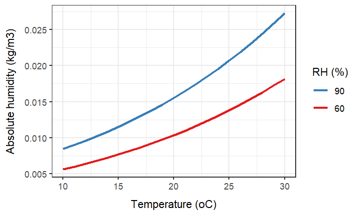

It is seen how warmer air can hold more water vapour.

The saturated absolute humidity only depends on temperature (eqs. $\ref{eq_svp}$ and $\ref{eq_h_abs}$),
$$
H_{sat}^{abs}\left(T \right) = M_{w}\frac{H_{sat}(T)}{R(T+T_0)}
$$
The condensation rate at the glass $C_{glass}^{cond}$ (kg/m^2^ ground/s) is proportional to the difference between the saturated absolute humidity at the glass and the absolute humidity of the air ([GCC, eqs. 3.4.18, 3.4.23](https://www.wageningenacademic.com/doi/book/10.3920/978-90-8686-501-7)),
$$
\begin{equation}
C_{glass}^{cond} = C_{ai}c\left\lfloor H_{in}^{abs} - H_{sat}^{abs}(T_{glass})\right\rfloor_0
\label{eq_condensation}
\end{equation}
$$
with units
$$
\left[\frac{\text{kg}}{\text{m}^2\text{ ground}\cdot\text{s}}\right] =
\left[\frac{\text{m}^2\text{ cover}}{\text{m}^2\text{ ground}}\right] \cdot
\left[\frac{\text{m}^3}{\text{m}^2\text{ cover}\cdot\text{s}} \right] \cdot
\left[\frac{\text{kg}}{\text{m}^3}\right]
$$
where $C_{ai}$ is the cover/ground area index (eq. $\ref{eq_cai}$) and $c$ (m/s) is an empirical parameter. For condensation on screens, $C_{ai}$ must be replaced with the ratio of the screens-drawn area to ground area.

Pieters et al. (1996) estimated $c$  from data collected in a controlled experiment with $T_{in}=20$&deg;C and $T_{out}=10$&deg;C at relative humidity $H_{in}^{rel}=(70\%, 80\%, 85\%,90\%)$. The temperature of the glass was not measured. We transformed the experimental $H_{in}^{rel}$ to $H_{in}^{abs}$ and tentatively assumed a glass temperature between the inner and outer temperature, $T_{glass}=(13,15,17)$&deg;C. We estimated $c=2\cdot10^{-3}$ m/s, as seen in the figure, where the points show the experimental data:

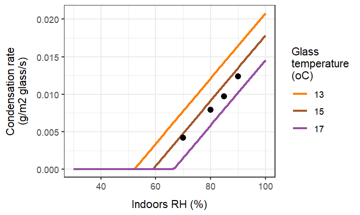

This estimate of $c$ is in accord with that in  [GCC](https://www.wageningenacademic.com/doi/book/10.3920/978-90-8686-501-7) (eq 3.4.23), which has $C_{ai}c=3\cdot10^{-3}$ m/s. With a typical value of $C_{ai}=1.5$ m^2^/m^2^, the  two estimates are equivalent.

This figure shows the condensation rate, depending on glass temperature, at indoors temperature $T_{in}=24$&deg;C and two different indoors humidities $H_{in}^{rel}=(60\%,90\%)$,

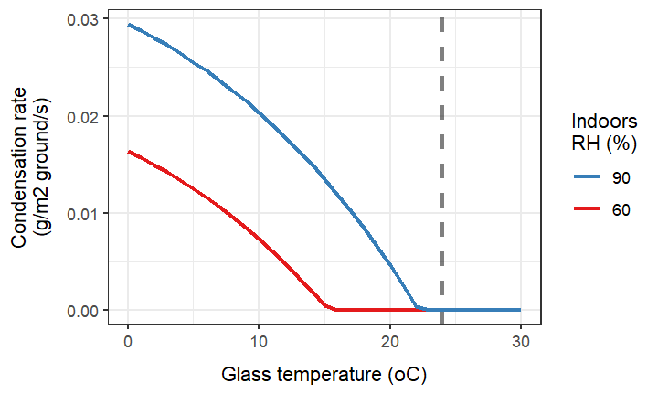

The vertical line at $24$&deg;C highlights that at high indoors humidity (90%), just a slightly cooler glass will accumulate condensation. The condensation rate is in the same range as transpiration, e.g., at 90% humidity and a glass temperature of 10&deg;C, the condendation rate is $0.02$ g/m^2^/s (read off the figure) giving $1.2$ g/m^2^/min.


###  Ventilation

Ventilation causes mass movement of water vapour between outdoors and indoors air. To calculate the resultant change in indoors absolute humidity $\Delta H_{in}^{abs}$ (kg/m^3^) during one time step $\Delta t$ (s), eq. $\ref{eq_advection_temp}$ can be rewritten as
$$
\begin{equation}
\Delta H_{in}^{abs} = [H_{out}^{abs} - H_{in}^{abs}(0)] \left[1-exp\left(-\frac{v}{3600 \text{ s/h}}\Delta t \right)\right]
\label{eq_advection_hum}
\end{equation}
$$
where $H_{in}^{abs}(0)$ (kg/m^3^) is the indoors absolute humidity at the beginning of the time step.

The average rate of water lost by mass movement during the time step is
$$
\begin{equation}
\frac{\Delta H_{in}^{abs}}{V_{ai}\Delta t}
\quad
\left[\frac{\text{kg}}{\text{m}^2\cdot\text{s}
 } \right]
\label{eq_advection_hum_flux}
\end{equation}
$$
where $V_{ai}$ is the volumetric area index (eq. $\ref{average_height}$).

This is depicted in the following figure at a ventilation rate of $v=3\text{ h}^{-1}$ and with temperatures inside $T_{in}=24$&deg;C and outside $T_{out}=10$&deg;C. The relation is shown at two different indoors humidities and varing outdoors humidity,

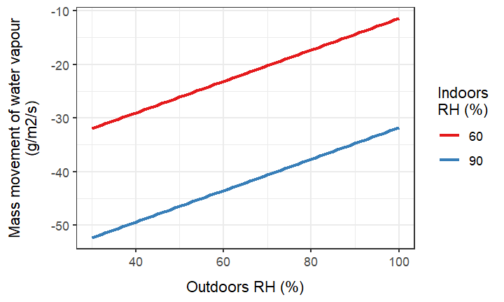

The cooler outdoors air can hold only little water. Hence, ventilation is an effective means of lowering indoors humidity. The effect is larger with more humid indoors. The flux of water vapour is negative because water is lost from the greenhouse. Since the humid indoors air holds latent heat originally captured by transpiration, ventilation also functions as an indirect route of venting excess heat.

## Latent heat

The latent heat carried by water vapour is released during condensation. Knowing the condensation rate at the glass $C_{glass}^{cond}$ (kg/m^2^ ground/s) (eq. $\ref{eq_condensation}$), it is straightforward to calculate the heat, which is assumed to be absorbed by the glass immediately at a rate of $A_{glass}^{cond}$ (W/m^2^ ground),
$$
A_{glass}^{cond} = \lambda C_{glass}^{cond}
$$
The heat of vapourisation $\lambda=2\,454$ kJ/kg determines the energy released by the phase shift.

#### Computation example

The  model was extended with a water budget shown as three columns (in g/m^2^) in the output, `Tr` (transpration), `Cn` (condensation) and `Mv`  (mass movement). This is the outcome of the final `7-energy-budget-complete.R` script:

```
        Layer     T     C     E    E_     A    A_   U  U_     H    H_ Cn SumNetAH
1         Sky -10.0   Inf 271.9   0.0   0.0 370.6 0.0 0.0   0.0   0.0  0  18474.8
2       Glass  13.0  8400 335.8 335.8 239.3 338.9 6.4 2.8 -20.9  32.2  2 -16989.9
3      Screen  21.6  2280 242.3  29.8  26.8 273.3 1.2 1.2   4.4   4.4  0   8193.8
4       Light    NA   Inf  15.0  15.0   0.0   0.0 0.0 0.0  -5.0  -5.0  0  -7200.0
5       Plant  25.4   Inf 355.9 355.9   0.0   0.0 0.0 0.0   0.0   0.0  0  24663.7
6     Heating    NA   Inf  75.0  75.0   0.0   0.0 0.0 0.0 -50.0 -50.0  0 -45000.0
7       Floor  12.5 42000   0.0 226.3 332.5   0.0 1.2 0.1  14.8  -0.6  0  21650.9

    Volume    T    C    H     V   RH SumNetHV
1 Outdoors 10.0  Inf 20.9  58.1 60.0  15263.8
2  Indoors 24.8 4780 54.1 -58.1 98.1  -1169.0
3     Soil  6.0  Inf  0.6   0.0   NA    111.9

    Volume    Tr     Cn     Mv
1 Outdoors  0.00  0.000  2.532
2  Indoors 16.12 -0.009 -2.532
```


```
        Layer     T     C     E    E_     A    A_   U  U_     H    H_ Cn SumNetAH SumCn
1         Sky -10.0   Inf 271.9   0.0   0.0 370.6 0.0 0.0   0.0   0.0  0  18474.8   0.0
2       Glass  13.0  8400 335.8 335.8 239.3 338.9 6.4 2.8 -20.9  32.2  2 -16989.9  10.8
3      Screen  21.6  2280 242.3  29.8  26.8 273.3 1.2 1.2   4.4   4.4  0   8193.8   0.0
4       Light    NA   Inf  15.0  15.0   0.0   0.0 0.0 0.0  -5.0  -5.0  0  -7200.0   0.0
5       Plant  25.4   Inf 355.9 355.9   0.0   0.0 0.0 0.0   0.0   0.0  0  24663.7   0.0
6     Heating    NA   Inf  75.0  75.0   0.0   0.0 0.0 0.0 -50.0 -50.0  0 -45000.0   0.0
7       Floor  12.5 42000   0.0 226.3 332.5   0.0 1.2 0.1  14.8  -0.6  0  21650.9   0.0

    Volume    T    C    H     V   RH SumNetHV
1 Outdoors 10.0  Inf 20.9  58.1 60.0  15263.8
2  Indoors 24.8 4780 54.1 -58.1 98.1  -1169.0
3     Soil  6.0  Inf  0.6   0.0   NA    111.9

    Volume    Tr     Cn     Mv
1 Outdoors 0.000  0.000  2.532
2  Indoors 8.060 -0.004 -2.532
```

The output shows the outcome after one time step $\Delta t=180$ s, still divided into $n=6$  minor time steps for the calculations. Thus, $8.0$ g/m^2^ (`Tr` column) was transpired by the crop. Meanwhile ventilation got rid of $2.5$ g/m^2^ (`Mv` column) of the the transpired water. 

The condensed water amounted to $0.00440$ g/m^2^ (`Cn` column). Multiplication by the latent heat of evaporation $\lambda=2\,454$ J/g leads to the amount of released energy,
$$
0.00440\text{ g/m}^2\cdot2\,454\text{ J/g} = 10.8\text{ J/m}^2
$$
which appears in the `SumCn` column for the glass layer. The increase in glass temperature caused by condensation alone, taking the heat capacity of the glass layers $C_{glass}=8\,400$ J/K/m^2^ into consideration, amounted to very little,
$$
\Delta T_{glass}[\text{condensation}] = \frac{10.8 \text{ J/m}^2}{8\,400 \text{ J/K/m}^2} = 0.0013\text{ K}
$$
Indoors humidity was initialised high at 90% but increased even more to 98.1%, despite the lower outdoors humidity at 60%. In a real greenhouse, ventilation would need to be increased to push humidity down.

The total energy budget changed very little and remained in balance:
$$
A_i^{net}[\text{layers}] + A_i^{net}[\text{volumes}] = 3\,793+14\,207=18\,000 \text{ J/m}^2
$$
It is worth noting that the latent heat, which escaped by ventilation, is not part of the energy budget. In this example it amounted to
$$
2.532\text{ g/m}^2\cdot2\,454\text{ J/g} = 6\,214\text{ J/m}^2
$$
These $6\,214$ J/m^2^ were originally captured as radiative heat by the canopy and turned into latent heat. They do not constitute an extra loss of energy from the greenhouse, i.e.they do not act as an extra cooling mechanism, as humid air leaves through the vents. 

## CO~2~ budget

We use the Ideal Gas Law earlier on (eq. $\ref{eq_ideal_gas_law}$) to calculate condensation. Here we apply it to convert CO~2~ concentration from $[CO_2]^{ppm}$ (ppm) to absolute concentration $[CO_2]^{abs}$ (g/m^3^):
$$
\begin{split}
[CO_2]^{abs} &= \frac{[CO_2]^{ppm}}{10^6} \cdot \frac{P}{RT} \cdot M_{CO_2} \\[6pt]
&= \frac{[CO_2]^{ppm}}{10^6} \cdot \frac{101\,325\text{ Pa}}{8.314\text{ m}^3\text{ Pa/K/mol}} \cdot 44\text{ g/mol} \\[6pt]
&= 
1.829\frac{\text{mg/m}^3}{\text{ppm CO}_2} \cdot [CO_2]^{ppm}
\end{split}
$$
As an example, with [greenhouse dimensions](#greenhouse-dimensions) of $10\,000$ m^2^ area and a volume of $39\,384$ m^3^, how much CO~2~ would we need to increase indoors CO~2~ from 400 ppm to 900 ppm? This would amount to
$$
1.829\frac{\text{mg/m}^3}{\text{ppm CO}_2} \cdot 39\,384 \text{ m}^3 \cdot 500 \text{ ppm CO}_2 = 36.0\text{ kg CO}_2
$$
or
$$
\frac{36.0\text{ kg CO}_2}{10\,000 \text{ m}^2} = 3.60\text{ g CO}_2/\text{m}^2
$$
or
$$
\frac{36.0\text{ kg CO}_2}{39\,384 \text{ m}^3} = 0.915\text{ g CO}_2/\text{m}^3
$$
However, the plants will take up CO~2~ which must be compensated for to keep up the CO~2~ concentration. For example, a tomato crop grown at a leaf area index of $3.0$ with a CO~2~ uptake rate of $1.29$ mg CO~2~/m^2^ leaf/s [(Heuvelink, 1995)](https://doi.org/10.1006/anbo.1995.1035) will need
$$
1.29\frac{\text{ mg CO}_2}{\text{m}^2\text{ leaf}\cdot\text{s}} \cdot 
3\frac{\text{m}^2\text{ leaf}}{\text{m}^2\text{ floor}} \cdot
3\,600\frac{\text{s}}{\text{h}} \cdot
\frac{\text{g}}{1000 \text{ mg}} =
13.9 \text{ g CO}_2/\text{m}^2/\text{h}
$$
or
$$
13.9 \text{ g CO}_2/\text{m}^2/\text{h} \cdot \frac{10\,000\text{ m}^2}{39\,384\text{ m}^3} = 
3.54 \text{ g CO}_2/\text{m}^3/\text{h}
$$
Meanwhile, CO~2~ is lost to the outdoors even with all windows closed due to leakage, maybe at a rate of some $0.5$ to $1.0$ per hour, depending on wind conditions.

The whole CO~2~ budget can be expressed in the differential equation,
$$
\frac{d[CO_2]_{in}^{abs}}{dt} = c+v\left([CO_2]_{out}^{abs} - [CO_2]_{in}^{abs} \right)
$$
with

* $c$ (g  CO~2~/m^3^/h) the balance of CO~2~ injection minus  CO~2~ fixation
* $v$ (h$^{-1}$) the ventilation rate (controlled + leakage)
* $[CO_2]_{in}^{abs}$ and $[CO_2]_{out}^{abs}$ (g CO~2~/m^3^) the CO~2~ concentration indoors and outdoors, respectively

Integration gives us the following solution of the $[CO_2]_{in}^{abs}$ time trend with fixed rates $c$ and $v$,
$$
\begin{equation}
[CO_2]_{in}^{abs}(t) = exp(-vt)\left\{ 
[CO_2]_{in}^{abs}(0) + \left( \frac{c}{v}+[CO_2]_{out}^{abs} \right)
\left( exp(vt)-1\right)
\right\},\quad v>0
\label{eq_c00_integration}
\end{equation}
$$
The figure below illustrates eq. $\ref{eq_c00_integration}$ with the following parameter settings:

* $[CO_2]_{in}^{abs}(0) = 500\text{ ppm}\cdot 1.829\text{ mg CO}_2\text{/m}^3\text{/ppm} = 0.915\text{ g CO}_2\text{/m}^3$
* $[CO_2]_{out}^{abs} = 400\text{ ppm}\cdot 1.829\text{ mg CO}_2\text{/m}^3\text{/ppm} = 0.732\text{ g CO}_2\text{/m}^3$
* $v\in\{0.5,1.0\}\text{ h}^{-1}$
* $c\in\{0.0,0.5\}\text{ g CO}_2\text{/m}^3\text{/h}$

The time course of the indoors CO~2~ is shown on the y-axis as $[CO_2]_{in}^{ppm}$, i.e. converted to ppm:

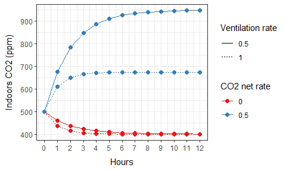

Note that $c=0$ implies that CO~2~ injection and fixation cancel out. In other words, the injection rate equals the fixation rate ($3.54 \text{ g CO}_2/\text{m}^3/\text{h}$ in the example above). Hence $c=0.5$ implies an injection rate of $4.04 \text{ g CO}_2/\text{m}^3/\text{h}$. With no net gain in CO~2~ (red curves) the indoors concentration falls from the initial 500 ppm to the outdoors 400 ppm, whereas with a net gain (blue curves) the indoors concentration approaches an asymptote. With increased ventilation (dashed curves) the blue asymptote is lowered, whereas the red asymptote is approached more quickly.

In the full model the CO~2~ [setpoint](#co2-setpoint), [controller](#co2-controller) and [actuator](#co2-actuator) will collaborate to adjust the injection rate, so that the indoors CO~2~ concentration is maintained at the setpoint. The injection rate $c_{inj}$ (g/m^2^/h) (see [CO~2~ actuator](#co-2-actuator)) and the fixation rate $P_n^{canopy}$ (&mu;mol /m^2^ ground/s) (see [Canopy photosynthesis](#canopy-photosynthesis)). The exchange rates between units are
$$
\begin{split}
1\left[\frac{\text{g}}{\text{m}^2\cdot\text{h}}\right] &= 
1\left[\frac{\text{g}}{\text{m}^2\cdot\text{h}}\right] \cdot
\frac{A_{gh}}{V_{gh}}\left[\frac{\text{m}^2}{\text{m}^3}\right] \\[6pt]
&= 
\frac{A_{gh}}{V_{gh}} \left[\frac{\text{g}}{\text{m}^3\cdot\text{h}}\right]
\end{split}
$$
and
$$
\begin{split}
1\left[\frac{\mu\text{mol}}{\text{m}^2\cdot\text{s}}\right] &=
1\left[\frac{\mu\text{mol}}{\text{m}^2\cdot\text{s}}\right] \cdot
\frac{A_{gh}}{V_{gh}}\left[\frac{\text{m}^2}{\text{m}^3}\right] \cdot
44.01\left[\frac{\text{g}}{\text{mol}} \right] \cdot
10^{-6}\left[\frac{\text{mol}}{\mu\text{mol}} \right] \cdot
3\,600\left[\frac{\text{s}}{\text{h}} \right] \\[6pt] 
&= 0.1584\frac{A_{gh}}{V_{gh}} \left[\frac{\text{g}}{\text{m}^3\cdot\text{h}}\right]
\end{split}
$$
with greenhouse area $A_{gh}$ and volume $V_{gh}$.

## Implementation notes

### Optimisation

The combined energy and water budget is a central part of the model. It is where most computation takes place and where most execution time is spent. Therefore it is worth optimising its performance. This can be achieved by varying the number of minor time steps $n$, which determines the effective time step $\Delta t/n$ of the budget computation. One possible algorithm for determining $n$ is

1. Set $n=1$.

2. Compute the budget for one minor time step of length $\Delta t/n$ and determine the maximum change in temperature of any layer or volume $\Delta T_{max}$.

3. If the max. temperature change exceeds a critical limit $\Delta T_{max}>\Delta T_{crit}$ then re-calculate $n$ by
   $$
   n=\left\lceil \frac{\Delta T_{max}}{\Delta T_{accept}} \right\rceil
   $$
   where $\Delta T_{accept}$ is the acceptable change and $\lceil .. \rceil$ rounds up, Then go back to step 2.

4. Complete the budget computation for the remaining $2..n$ minor time steps and determine $\Delta T_{max}$ for the whole procedure.

5. Re-calculate $n$ by the same equation as in step 3 and go back to step 2. This completes one simulation time step of length $\Delta t$ for the budget.

This algorith will adjust $n$ both upwards and downwards as deemed sufficient by the limits, which could be for example $\Delta T_{accept}=0.5$ K and $\Delta T_{crit}=1.5$ K. The backtracking that could happen in step 3 should be avoided as much as possible to save time. The expectation is that during the night $n$ would be 1. In the daytime it would be higher and when abrupt changes occur in the driving variables (e.g., when growth lights are switched on), it would be even larger for a short while. The simulation time step $\Delta t$ could be rather large, maybe 5 or even 10 minutes. The proper tradeoff between precision and execution time must be found by simulation.

# Photosynthesis

## Leaf photosynthesis

The photosynthesis model is identical to the implementation in the `Photosyn` function found in the `plantecophys` R package [(Duursma, 2015)](https://journals.plos.org/plosone/article?id=10.1371/journal.pone.0143346). The `Photosyn` function was re-coded in C++ keeping only the functionality needed for our purpose. However, boundary layer conductivity $g_b$ (mol/m^2^/s) was added to the function, which originally accounted only for stomatal conduction $g_s$ (mol/m^2^/s). Assuming that boundary layer and stomata work like resistors in a series, they are additive,
$$
\frac{1}{g_t} = \frac{1}{g_b}+\frac{1}{g_s} \quad\Leftrightarrow\quad 
g_t=\frac{g_b g_i}{g_b+g_i}
$$
where $g_t$ (mol/m^2^/s) is the total conductance. All conductances are for water vapour; they are translated into CO~2~ conductances where needed in the model.

In the overview of variables and parameters below, the mathematical symbols used in this treatise (e.g., $I_{abs}$) are listed together with their name in the code (e.g., `PPFD`). The re-coded versions of the original `Photosyn` functions can be found in the `photosynthesis.R` script and, equivalently, in the `photosynthesis.cpp` source code. All m^2^ units are per m^2^ leaf. This is stated explicitly only where there is room for confusion.

* Environmental and plant variables:

  * $c_{in}^{CO2}$: Indoors CO~2~ concentration (ppm)  (`Ca`)

  * $F^{leaf}$: Incident PAR (&mu;mol/m^2^ leaf /s) (`PPFD`)

  * $H_{in}^{rel}$: Indoors relative humidity of the air (%) (`RH`)

  * $T_{plant}$: Leaf temperature (&deg;C) (`Tleaf`)

  * $g_s$: Stomatal conductance for water vapour (mol/m^2^/s)  (`GS`)

  * $g_b$: Boundary layer conductance for water vapour (mol/m^2^/s) (`GB`)


* Obligatory species-specific parameters:

  * $J_{max}^{25}$: Maximum rate of electron transport at 25&deg;C (&mu;mol/m^2^/s) (`Jmax`)

  * $V_{cmax}^{25}$: Maximum carboxylation rate  at 25&deg;C (&mu;mol/m^2^/s) (`Vcmax`)

  * $\Gamma^*$: CO~2~ compensation point (ppm) (`GammaStar`)

  * $K_m$: Michaelis-Menten coefficient for Farquhar model (Pa) (`Km`)

  * $R^{25}$: Respiration rate at 25&deg;C (&mu;mol/m^2^/s) (`Rd0`)


* Optional species-specific parameters (with default values):

  * $a$: Quantum yield of electron transport (0.24 mol/mol) (`alpha`)

  * $\theta$ : Shape of light response curve (0.85) (`theta`)

  * Temperature response of $J_{max}$:
    * $J_{Ea} = 29\,680$ (`EaJ`)
    * $J_{EdV}= 2\cdot 10^5$ (`EdVJ`)
    * $J_{dels}= 631.88$ (`delsJ`)

  * Temperature response of $V_{cmax}$:
    * $V_{Ea}=58\,550$ (`EaV`)
    * $V_{EdVC}= 2\cdot 10^5$ (`EdVC`)
    * $V_{delsC}=629.26$ (`delsJ`)

  * Respiration rate:
    * $Q_{10}$: Temperature correction of $R^{25}$ ($1.92$) (`Q10`)


* Function outputs:

  * $c_i^{CO2}$: Intercellular CO~2~ concentration (ppm) `Ci`

  * $P_n$: Net  photosynthesis rate (&mu;mol/m^2^ leaf/s) `ALEAF`

  * $P_j$: Gross photosynthesis rate limited by electron transport rate (&mu;mol/m^2^ leaf/s) (`Aj`)

  * $P_c$: Gross photosynthesis rate limited by carboxylation rate (&mu;mol/m^2^ leaf/s) (`Ac`)

  * $R$: Respiration rate  (&mu;mol/m^2^ leaf/s) (`Rd`)


The `photosynthesis.R` script produces this figure to illustrate the output of the `photosynthesis` function (parameter values can be found in the code):

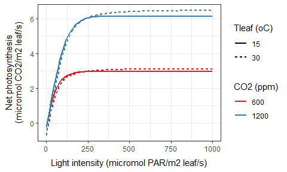

We see the expected form of the light response curve with positive effects of light, temperature and CO~2~. Internally, the model lets the more limiting process, electron transport or carboxylation rate (as judged from $P_j$ and $P_c$), decide the net outcome $P_n$.

## Canopy photosynthesis

The [energy budget](#energy-budget) model computes the total PAR absorbed by the plant canopy per m^2^ *ground* over one simulation time step, most of it coming from above $A_{plant}^{par}$ with a little coming from below ${A_{plant}^{par}}'$ due to reflection. Here, we define for convenience a new variable for the total canopy PAR absorption per ground area:
$$
A_{ground} = A_{plant}^{par} + {A_{plant}^{par}}' \quad\quad \mu\text{mol/m}^2 \text{ ground}
$$
By correcting for the leaf area index $L_{ai}$ (m^2^ leaf/m^2^ ground), we get the absorption per leaf area:
$$
A_{leaf} = \frac{A_{ground}}{L_{ai}}  \quad\quad \mu\text{mol/m}^2 \text{ leaf}
$$
However, the [leaf photosynthesis](#leaf-photosynthesis) model takes *incident* PAR $F_{leaf}$ (&mu;mol/m^2^ leaf/s) as a parameter, not the absorbed PAR. $F_{leaf}$ is used in the leaf synthesis model to calculate the electron transport rate $J$ (&mu;mol/m^2^ leaf/s),
$$
J = \frac{a F_{leaf} + J_{max} - 
\sqrt{(a F_{leaf}+J_{max})^2 - 4a F_{leaf}\theta J_{max}}} 
{2\theta}
$$
where $J_{max}$ (&mu;mol/m^2^ leaf/s) is the the maximum rate corrected for leaf temperature, and other parameters are as specified for the leaf photosynthesis model. We can derive $F_{leaf}$ from $A_{leaf}$ by correcting for leaf PAR absorptivity $\alpha_{leaf}^{par}\in[0;1]$ and the simulation time step $\Delta t$ (s),
$$
F_{leaf} = \frac{A_{leaf}}{\alpha_{leaf}^{par}\,\Delta t}
$$
The immediate outputs from the leaf photosynthesis model are all per leaf area, e.g., the net photosynthetic rate $P_n$ (&mu;mol/m^2^ leaf/s). These rates can be turned into per ground area units by multiplication with the leaf area index to express the rates at canopy level, e.g., $P_n^{canopy}=L_{ai}P_n$ (&mu;mol/m^2^ ground/s).

With a basic parameter setting for the canopy model, $L_{ai}=1$ and $\alpha_{leaf}^{par}=1$, the leaf and canopy photosynthesis models give the exact same numerical result, even though one is per leaf area and the other is per ground area. Below (produced by the `photosynthesis.R` script) the canopy photosynthesis $P_n^{canopy}$ is shown with the same parameter setting for the leaf area model as in the previous figure and with $L_{ai}=3$ and $\alpha_{leaf}^{par}=0.9$ in the canopy model:

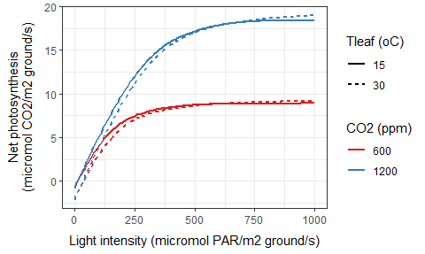

The self-shading of the canopy brings light intensity down by a factor of $L_{ai}$ which shifts the light response away from asymptotic saturation towards the linear part of the response. This is a simplification, which by itself leads to an overestimate of photosynthesis, since in reality the top leaves might approach light saturation. On the other hand, the plant can compensate for the dwindling light level down through the canopy by producing shade-adapted leaves, i.e. leaves with a light response curve that rises more steeply at low light levels. 

Another factor that creates uncertainty in the photosynthesis model is the uncertainty of the boundary layer resistance ($r_b=g_b^{-1}$). It is difficult to estimate empirically under greenhouse conditions, where it depends on plant architecture as well as air movement caused by ventilation and fans. Thus top leaves are likely to experience a smaller $r_b$ than leaves further down in the canopy. 

The gradients of light and $r_b$ in the plant canopy affects the photosynthesis model in opposite directions. The light gradient can be taken into account by Gaussian integration [(Goudriaan, 1986)](https://doi.org/10.1016/0168-1923(86)90063-8), while the $r_b$ gradient must be estimated from published studies. In any case, if the estimation of primary production (e.g. as biomass produced per day) is important, the model will need to be calibrated to the specific greenhouse setting. This includes $r_b$, as well as the species-specific parameters of the leaf photosynthesis model. 

If the model is used to explore photosynthesis under different scenarios (e.g., different climate control strategies), the estimated photosynthesis can be used to compare their relative performance. However, the uncertainties and unknowns should be taken into account. The installation of fans will reduce $r_b$, but by how much? Greenhouse temperature influences photosynthesis but have we got accurate estimates of the temperature response of $J_{max}$ and $V_{cmax}$ in the leaf photosynthesis models? One should interpret model predictions of photosynthesis with care. 

# Climate control

Traditionally, greenhouse climate is controlled by two temperature [setpoints](#setpoints): one for ventilation $\sp{vent}{}$ (&deg;C) and one for heating $\sp{heat}{}$ (&deg;C):

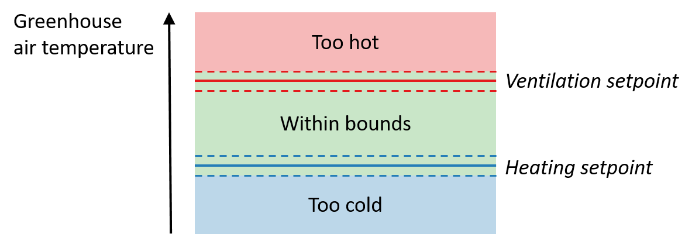

The humidity is controlled indirectly through manipulation of the temperature setpoints, e.g., if it is too humid then the ventilation setpoint is lowered.

In the model, greenhouse air temperature $T_{in}$ (&deg;C) is considered to be within bounds if it is between the two setpoints $\pm$ a tolerance $\epsilon_{tol}$ (&deg;C). Otherwise, it is either too hot or too cold. The model emulates the climate control computer in a real greenhouse through the logic below, which has  five possible outcomes: Turn heating up or down, turn ventilation up or down, or keep current heating and ventilation.

* If it is **too hot** $\left(T_{in}>\sp{vent}{}+\epsilon_{tol}\right)$: 
  * If **heating is on**, we are heating needlessly and must **turn down the heating**:
    * Decrease the pipe temperature $T_{pipe}$ (eq. $\ref{eq_t_pipe}$) by a default $\Delta T_{pipe}$ (&deg;C) and recalculate the energy budget to update $T_{in}$. If by this update it got too cold $\left(T_{in}<\sp{heat}{}-\epsilon_{tol}\right)$ then correct $\Delta T_{pipe}$ by linear interpolation aiming for $T_{in}\approx \sp{heat}{}$; otherwise, keep $\Delta T_{pipe}$.
  * If **heating is off**, we must **turn up ventilation**:
    * Increase the ventilation rate $v$ (eq. $\ref{eq_advection_temp}$) by a default $\Delta v$ (h$^{-1}$) and recalculate the energy budget to update $T_{in}$. If by this update it got too cold $\left(T_{in}<\sp{heat}{}-\epsilon_{tol}\right)$ then correct $\Delta v$ by linear interpolation aiming for $T_{in}\approx (\sp{vent}{}+\sp{heat}{})/2$; otherwise, keep $\Delta v$.
* If it is **too cold** $\left(T_{in} < \sp{heat}{}-\epsilon_{tol}\right)$: 
  * If **ventilation is on**, we are cooling needlessly and must **turn down ventilation**:
    * Decrease the ventilation rate $v$ (eq. $\ref{eq_advection_temp}$) by a default $\Delta v$ (h$^{-1}$) and recalculate the energy budget to update $T_{in}$. If by this update it got too hot $\left(T_{in}>\sp{vent}{}+\epsilon_{tol}\right)$ then correct $\Delta v$ by linear interpolation aiming for $T_{in}\approx (\sp{vent}{}+\sp{heat}{})/2$; otherwise, keep $\Delta v$.
  * If **ventilation is off**, we must **turn up heating**:
    * Increase the pipe temperature $T_{pipe}$ (eq. $\ref{eq_t_pipe}$) by a default $\Delta T_{pipe}$ (&deg;C) and recalculate the energy budget to update $T_{in}$. If by this update it got too hot $\left(T_{in}>\sp{vent}{}+\epsilon_{tol}\right)$ then correct $\Delta T_{pipe}$ by linear interpolation aiming for $T_{in}\approx \sp{heat}{}$; otherwise, keep $\Delta T_{pipe}$.
* If greenhouse temperature is **within bounds**:
  * **Keep current** pipe temperature $T_{pipe}$ and ventilation rate $v$.


The default corrections of pipe temperature $\Delta T_{pipe}$ and ventilation rate $\Delta v$ should accomodate to the simulation time step $\Delta t$ (s) :
$$
\begin{split}
\Delta T_{pipe} &= \dot{T}_{pipe}\Delta t \\[4pt]
\Delta v &= \dot{v}\Delta t
\end{split}
$$
where the default rates of change are $\dot{T}_{pipe}$ (&deg;C/s) and $\dot{v}$ (h$^{-1}$s$^{-1}$). 

