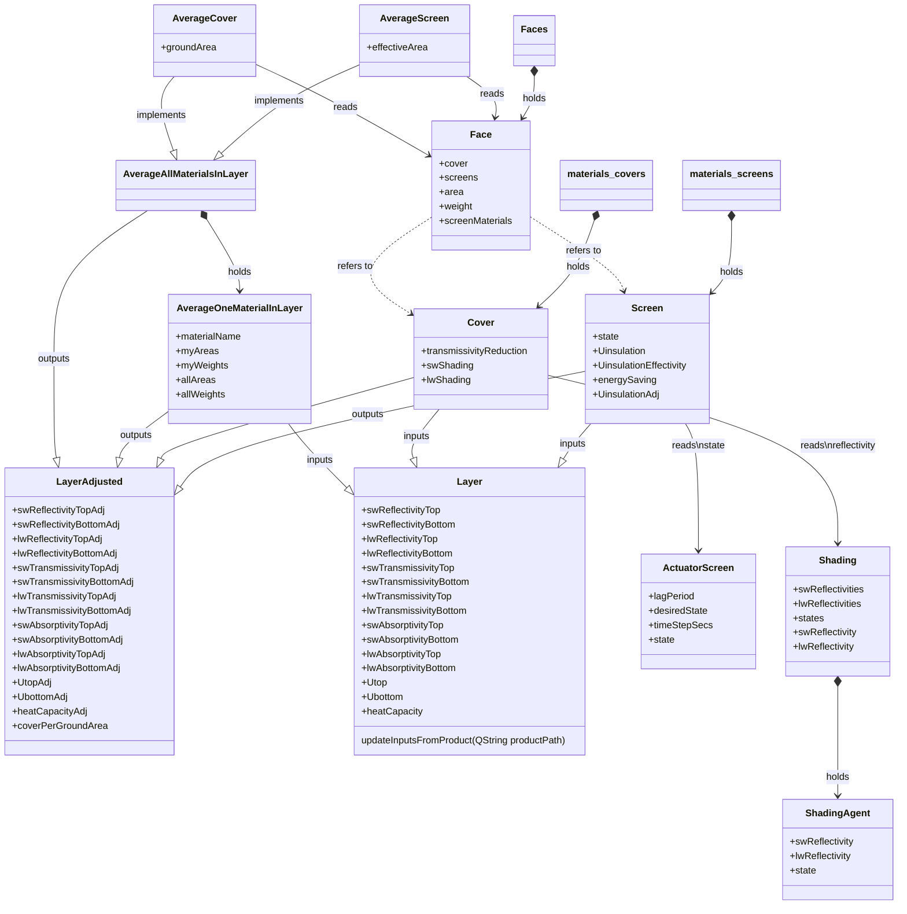

### Description

Objects of `Cover` and `Screen` has  inputs defined in the `Layer` mix-in class. The boxscript holds `Cover` and `Screen` objects in the `shelter/materials/covers` and `shelter/materials/screens`, respectively. Both covers and screens maintain their `LayerAdjusted` outputs according to the state of shading agents (for covers) and screen actuators (for screens). Screens also maintain their `UinsulationAdj` output.

The `shelter/faces` object holds one `Face` object representing each of the six faces of the greenhouse. In the reset step, the faces makes active those cover and screen products that are used and makes inactive those that are not. This is done to save computing power.

The four layers (cover, screen1, screen2, screen3) may each consist of a mixture of materials. Each layer holds a collection of materials used in that layer. The materials in these collections are each represented by an `AverageOneMaterialInLayer` object, which finds the average weighted by area of that material. The `sw..Adj` and `lw...Adj` are in addition weighted by their face `weight`. The `AverageAllMaterialsLayer` then calculates the total weighted sums of all `...Adj` outputs by summing the values held by its `AverageOneMaterialInLayer` objects.

They use the `updateInputsFromProduct` function to fetch the input values from the proper product.

