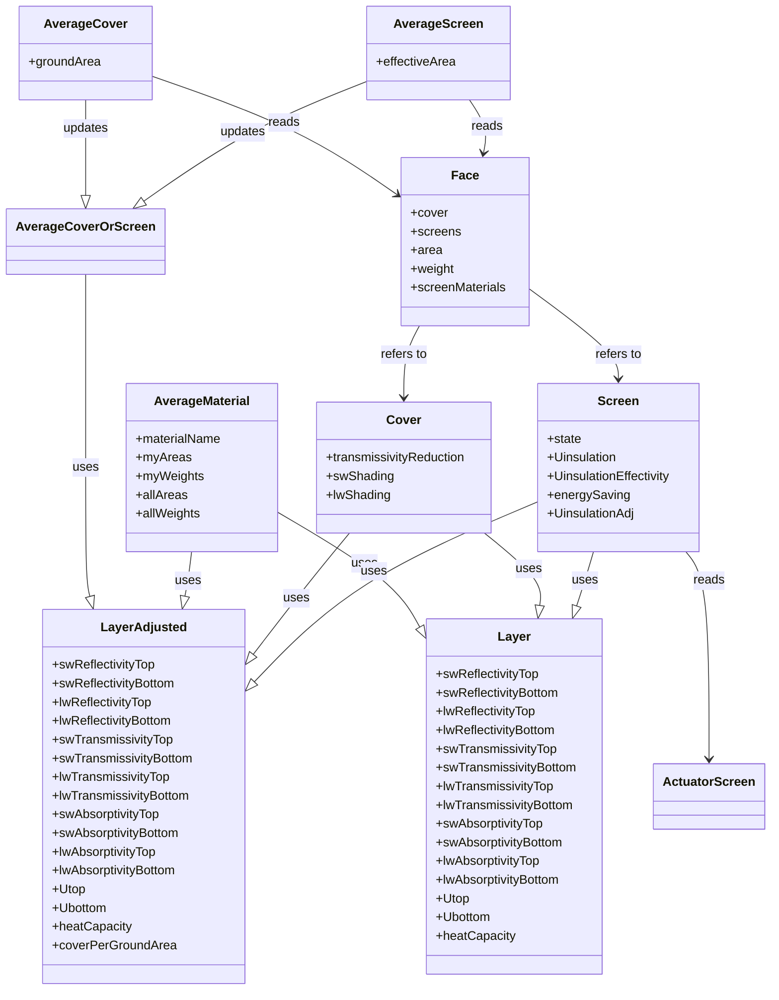

```mermaid
classDiagram
AverageCoverOrScreen --|> LayerAdjusted : uses
AverageCover --|> AverageCoverOrScreen : updates
AverageScreen --|> AverageCoverOrScreen : updates
AverageMaterial --|> LayerAdjusted : uses
AverageMaterial --|> Layer : uses
AverageCover --> Face : reads
AverageScreen --> Face : reads
Cover --|> Layer : uses
Cover --|> LayerAdjusted : uses
Screen --|> Layer : uses
Screen --|> LayerAdjusted : uses
Face --> Cover : refers to
Face --> Screen : refers to
Screen --> ActuatorScreen : reads
class Layer {
+swReflectivityTop
+swReflectivityBottom
+lwReflectivityTop
+lwReflectivityBottom
+swTransmissivityTop
+swTransmissivityBottom
+lwTransmissivityTop
+lwTransmissivityBottom
+swAbsorptivityTop
+swAbsorptivityBottom
+lwAbsorptivityTop
+lwAbsorptivityBottom
+Utop
+Ubottom
+heatCapacity
}
class LayerAdjusted {
+swReflectivityTop
+swReflectivityBottom
+lwReflectivityTop
+lwReflectivityBottom
+swTransmissivityTop
+swTransmissivityBottom
+lwTransmissivityTop
+lwTransmissivityBottom
+swAbsorptivityTop
+swAbsorptivityBottom
+lwAbsorptivityTop
+lwAbsorptivityBottom
+Utop
+Ubottom
+heatCapacity
+coverPerGroundArea
}
class AverageMaterial {
+materialName
+myAreas
+myWeights
+allAreas
+allWeights
}
class Cover {
+transmissivityReduction
+swShading
+lwShading
}
class Screen {
+state
+Uinsulation
+UinsulationEffectivity
+energySaving
+UinsulationAdj
}
class Face {
+cover
+screens
+area
+weight
+screenMaterials
}
class AverageCover {
+groundArea
}
class AverageScreen {
+effectiveArea
}
```

